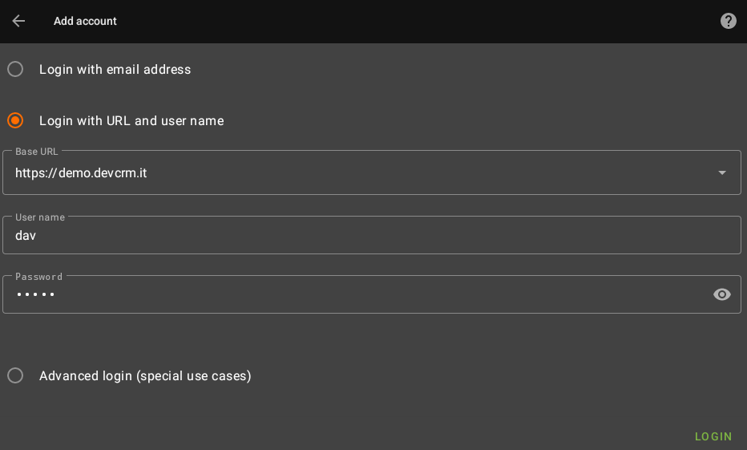

## How to connect to CalDAV server on EspoCRM

!!! tip "Client application"
    We're using on our phones application called [DAVx](https://play.google.com/store/apps/details?id=at.bitfire.davdroid)

1. Download on your device app which support DAV.
2. Enter address of your server (for CalDAV and CardDAV it's domain of your EspoCRM).
3. Enter credentials.
4. Configure settings inside application.
