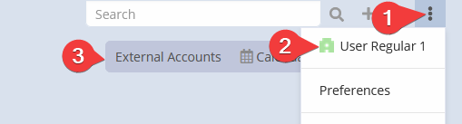
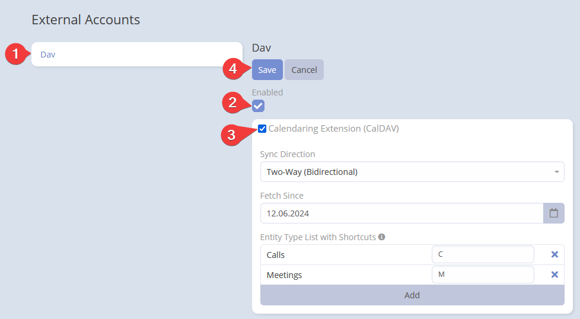

# CalDAV - Calendaring Extension

**Note:** Before you start, make sure you have set up the integration. If you haven't done that yet, please refer to the [DAV Integration for EspoCRM](index.md) documentation.

!!! important "Important"
    **Always use the full path** in your CalDAV client: `https://example.com/dav/server.php`

## Setting-up for users

After administrator has set up DAV integration, users can enable it for their accounts.

Go to your user profile detail view and click the *External Accounts* button.

Click *Dav* on the left panel. Then, check the *Enable* button and select *Calendaring Extension (CalDAV)*. Finally, click *Save*.

## Parameters

- **Sync Direction**: Choose between *One-Way to EspoCRM*, *One-Way to CalDAV Client*, or *Two-Way (Bidirectional)* synchronization.
- **Fetch Since**: The start date for fetching events.
- **Entity Type List with Shortcuts**: List of CalDAV entity types, defaulting to *Calls*, *Meetings*, and *Tasks*. The first entity or one with a blank shortcut is the default for new events. Use drag-and-drop to reorder.

!!! tip "Tip"
    You can use any *Event* type entity in CalDAV, including custom ones. For details on creating custom entities, see the official [documentation](https://docs.espocrm.com/administration/entity-manager/#creating-new-entity-type).
