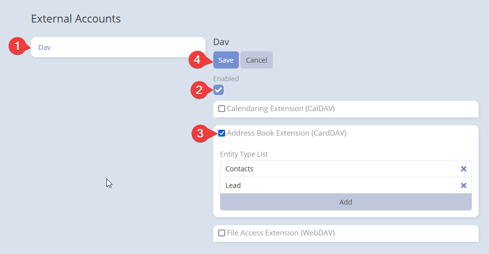

**Note:** Before you start, make sure you have set up the integration. If you haven't done that yet, please refer to the [DAV Integration for EspoCRM](index.md) documentation.

!!! important "Important"
    **Always use the full path** in your CardDAV client: `https://example.com/dav/server.php`

## Setting-up for users

After administrator has set up DAV integration, users can enable it for their accounts.

Go to your user profile detail view and click the *External Accounts* button.

Click *Dav* on the left panel. Then, check the *Enable* button and select *Address Book Extension (CardDAV)*. Finally, click *Save*.

## Parameters

- **Entity Type List**: A list of entity types available for CardDAV, defaulting to *Contacts* and *Leads*. The first type will be the default for new contacts. Use drag-and-drop to reorder.

!!! tip "Tip"
    You can use any *Person* type entity in CardDAV, including custom ones. For details on creating custom entities, see the official [documentation](https://docs.espocrm.com/administration/entity-manager/#creating-new-entity-type).
