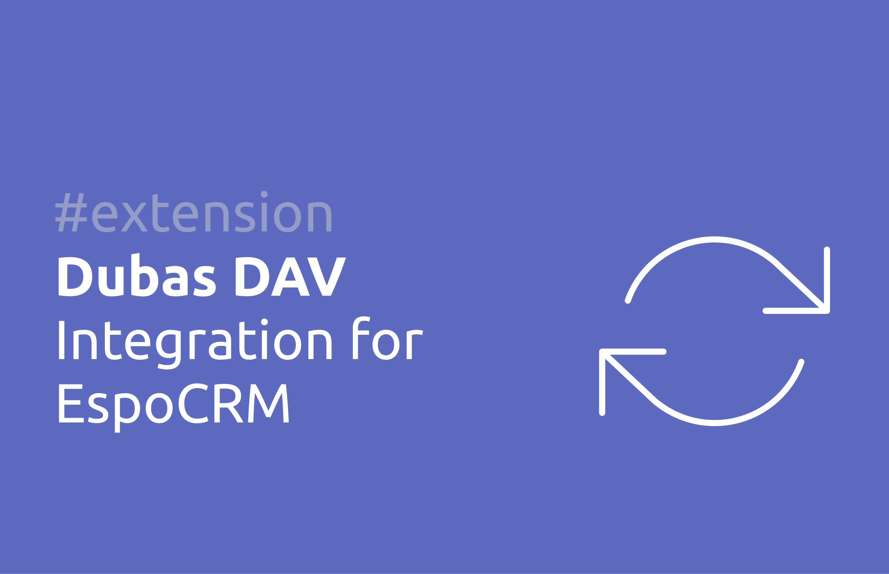

# Dubas DAV Integration for EspoCRM

DAV is HTTP protocol which allow to use CalDAV, CardDAV and WebDAV. Our integration add DAV features to EspoCRM. CalDAV allow to sync events from calendar in EspoCRM. CardDAV allow to sync contacts and leads from EspoCRM e.g. with your phone. WebDAV allow to sync files e.g. from your computer with Documents in EspoCRM. 

<!-- !!! tip "Purchase online"
    You can purchase this extension in our [marketplace](https://store.devcrm.it/product/dav/). -->

<!-- ## :material-cube-scan: Demo instance
You can check few features of this extension on our public demo. Go to [demo.devcrm.it](https://demo.devcrm.it) and login:

Username: **dav**  
Password: **dubas** -->

!!! note ""
    You can find more information on [our website](https://devcrm.it/dav).

## :material-playlist-check:  Requirements
- EspoCRM in version 7.0.0 or higher.

## :material-view-grid-plus: Installation
1.	Log in to your EspoCRM and go to Administration section.
2.	Go to section Extensions.
3. Install extension which you received from us.

## :material-tune: Initial configuration
1.	Go to **Administration > Integrations**.
2.	Choose DAV integration.
3.	Enable DAV integration.
4.	Save settings.
5.  Go to **Administration > Roles**.
6.  Create new role which will allow for access to **External Accounts**, **CalDAV**, **Calendar** **CardDAV**, **Contacts**, **WebDav** and **Documents**.
7.  Assign created role to users which should have access to CalDAV, CardDAV and WebDav. 

!!! example "Note"
    You can adjust your current roles with proper access to each DAV service. You can for example allow user only to use CalDAV.

Now you can start using DAV integration in your EspoCRM.

## :material-tune: User configuration
1. Log in on user account.
2. Click on the three vertical dots in the upper right corner and click on your name.
3. Click on **External accounts** button which is placed in top right corner.
4. Click on **Dav**.
5. Enable integration on your account by taping checkbox under **Enabled** text.
6. Save.

### Enable CalDAV integration
1. Go to External Accounts settings.
2. Click on **Dav**.
3. Tap checkbox next to **Calendaring Extension (CalDAV)**.
4. Choose sync direction.
5. Choose date since sync should work.
6. Specify entities with shortcuts.
7. Save.

### Enable CardDAV integration
1. Go to External Accounts settings.
2. Click on **Dav**.
3. Tap checkbox next to **Address Book Extension (CardDAV)**.
4. Add entities which should be synchronized.
5. Save.

### Enable WebDAV integration
1. Go to External Accounts settings.
2. Click on **Dav**.
3. Tap checkbox next to **File Access Extension (WebDAV)**.
4. Save.

!!! example "Note"
    If you want to check how to map drive your EspoCRM, [check this tutorial](./webdav/#how-to-map-drive-espocrm-in-windows).