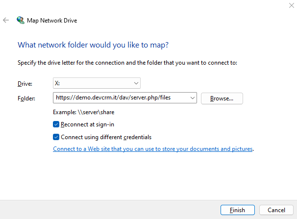

# WebDAV in DAV Integration for EspoCRM

## How to map drive EspoCRM in Windows

1. Go to **This PC** on your computer.
2. Click on **Map network Drive**.
3. Enter full to your EspoCRM with https and at the and of url enter /dav/files endpoint.
4. Tap checkbox next to **Connect using different credentials**.
5. Click **Finish**.
6. Enter credentials to your EspoCRM account.

You can use different applications like [WinSCP](https://winscp.net/eng/download.php) or [CyberDuck](https://cyberduck.io/download/) to connect to WebDAV server.