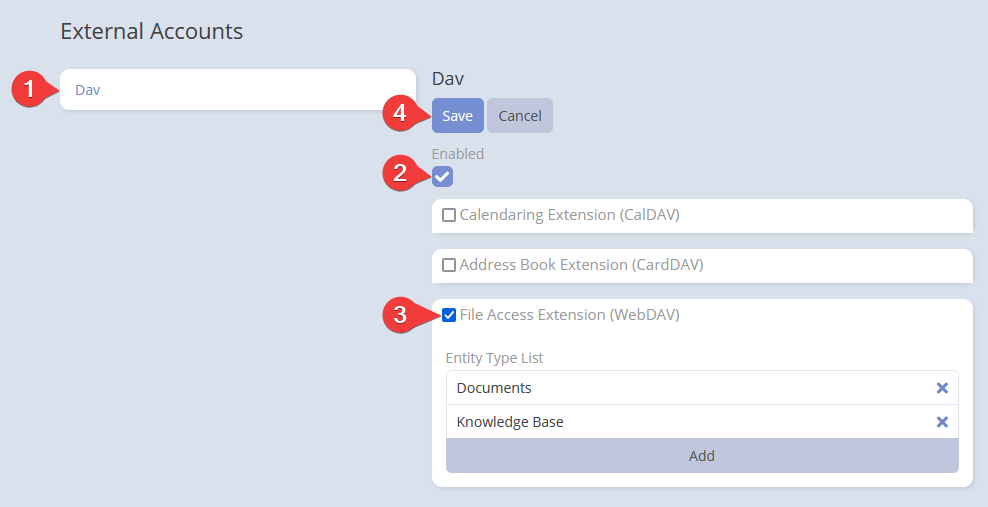

**Note:** Before you start, make sure you have set up the integration. If you haven't done that yet, please refer to the [DAV Integration for EspoCRM](index.md) documentation.

!!! important "Important"
    **Always use the full path** in your WebDAV client. Depending on the client, it may be:

    - `https://example.com/dav/server.php/files`
    - `https://example.com/dav/files`.

## Setting-up for users

After administrator has set up DAV integration, users can enable it for their accounts.

Go to your user profile detail view and click the *External Accounts* button.

Click *Dav* on the left panel. Then, check the *Enable* button and select *File Access Extension (WebDAV)*. Finally, click *Save*.

## Parameters

- **Entity Type List**: A list of entity types available for WebDAV, defaulting to *Documents* and *Knowledge Base*. Use drag-and-drop to reorder.
