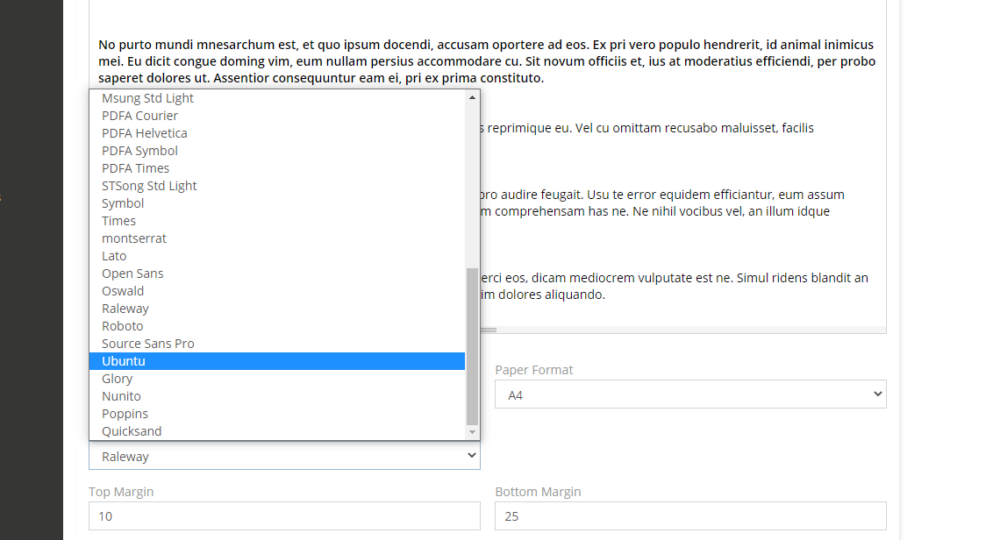

# Dubas Google Fonts Extension

## :material-information-outline: General Information
Dubas Google Fonts is an extension that will let you to use most popular fonts from Google Fonts inside your PDF's templates. This will allow you to beautify your PDF documents. Extension is really easy to use. Just have to install it and then, after rebuild, you'll see new fonts in PDF Template creator. 
!!! info
    There is a product page for this extension: [devcrm.it/google-fonts](https://devcrm.it/google-fonts)

## :material-playlist-check:  Requirements
- EspoCRM in version 6.1.0 or higher.
- PHP in version 7.3 or higher.

## Available fonts
- [Lato](https://fonts.google.com/specimen/Lato)
- [Montserrat](https://fonts.google.com/specimen/Montserrat)
- [Open Sans](https://fonts.google.com/specimen/Open+Sans)
- [Oswald](https://fonts.google.com/specimen/Oswald)
- [Raleway](https://fonts.google.com/specimen/Raleway)
- [Roboto](https://fonts.google.com/specimen/Roboto)
- [Source Sans Pro](https://fonts.google.com/specimen/Source+Sans+Pro)
- [Ubuntu](https://fonts.google.com/specimen/Ubuntu)
- [Glory](https://fonts.google.com/specimen/Glory?query=glory)
- [Nunito](https://fonts.google.com/specimen/Nunito)
- [Poppins](https://fonts.google.com/specimen/Poppins)
- [Quicksand](https://fonts.google.com/specimen/Quicksand?query=quicks)

## :material-book-plus-multiple: How to apply fonts and create PDF templat?
1. After you install our extension, **rebuild EspoCRM and clear cache**
2. Go to Administration -> PDF Templates
3. Create new PDF Template
4. Choose font
5. Save

!!! info "Why you have to rebuild EspoCRM?"
    That's because additional fonts can be removed, for example when you upgrade EspoCRM. When you click rebuild, our script will check if fonts are there, if not, then script will install fonts again. 

<!-- ## :material-cube-scan: Demo
You can check this extension on our demo instance: [demo.devcrm.it](https://demo.devcrm.it)  
Username: **send**  
Password: **dubas** -->

## :material-video-box: Video Presentation

  <iframe width="1280" height="400" src="https://www.youtube.com/embed/W10rQCZDlL0" frameborder="0" allowfullscreen></iframe>

