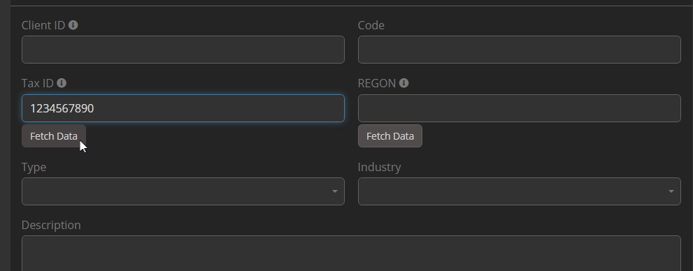

# Dubas GUS Integration for EspoCRM

The GUS Integration for EspoCRM allows for quick and efficient creation of customer records based on NIP, KRS, or REGON numbers. By leveraging data from the GUS Polish register, the extension automates the retrieval of business information, minimizing manual data entry and reducing errors.

!!! tip "Order Now"
    You can purchase this extension in our [marketplace](https://devcrm.it/product/gus).

### What is GUS?
The Polish Government Database GUS, or the Central Statistical Office of Poland, is the authoritative source of information on companies and institutions registered in Poland. It serves as the official repository for various data, including financial information, organizational details, and legal status. The database covers a wide range of entities, including private companies, public institutions, and nonprofit organizations.

## :material-video-box: Video Presentation

  <iframe width="1280" height="400" src="https://www.youtube.com/watch?v=i153uTDtEv4" frameborder="0" allowfullscreen></iframe>

## :material-playlist-check: Requirements
- EspoCRM version 8.1.0 or higher.
- PHP version 8.1 or higher.
- Active internet connection to access the GUS register.

## :material-view-grid-plus: Installation
1. Log in to your EspoCRM and go to the **Administration** section.
2. Navigate to the **Extensions** tab.
3. Install the extension provided by Dubas.

## :material-tune: Initial Configuration
1. Go to **Administration > Integrations**.
2. Select **GUS Integration**.
3. Enable the integration.
4. Enter GUS api key.
4. Configure the field mapping to match your existing CRM fields.
5. Save settings.

You can now use the integration to create new customer records based on identification numbers from the GUS register.

## :material-file-document-outline: How It Works
1. Enter a valid NIP, KRS, or REGON number in the respective field while creating a new customer.
2. Click the **Fetch data** button to fetch data from the GUS register.
3. The system will automatically fill in the available data, including:
   - Identification: REGON, NIP
   - Company Information: Name, business type, industry sector
   - Address Details: Province, district, community, city, street, property number, apartment number, postal code, post city
   - Contact Information: Phone number, email address, website
   <!-- - Representative Details: First name, last name -->
4. Adjust the data mapping if necessary and save the new customer record.

!!! warning "Important"
    Please remember that majority of fields in GUS are optional. If any of above fields is not filled in registry, it'll leave respective field in EspoCRM empty.

## How to obtain GUS API key
GUS Integration required API key from GUS registry. To obtain API key, you have to send an email. You can find details on [official website](https://api.stat.gov.pl/Home/RegonApi?lang=en)

## :material-alert-circle-outline: Limitations
- The integration **does not support updating** or overwriting existing records in EspoCRM for now.
- It only creates new customer records based on the provided identification numbers.
