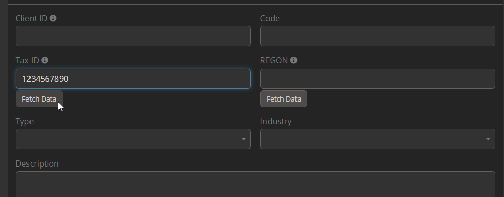

# Integracja Dubas GUS dla EspoCRM

Integracja GUS dla EspoCRM umożliwia szybkie i efektywne tworzenie rekordów klientów na podstawie numerów NIP, KRS lub REGON. Dzięki wykorzystaniu danych z polskiego rejestru GUS rozszerzenie automatyzuje pobieranie informacji o firmach, ogranicza ręczne wprowadzanie danych i zmniejsza liczbę błędów.

!!! tip "Zamów teraz"
    To rozszerzenie możesz kupić w naszym [marketplace](https://devcrm.it/product/gus).

### Czym jest GUS?
Polska baza danych GUS, czyli Główny Urząd Statystyczny, jest wiarygodnym źródłem informacji o firmach i instytucjach zarejestrowanych w Polsce. Stanowi oficjalne repozytorium różnych danych, w tym informacji finansowych, szczegółów organizacyjnych i statusu prawnego. Baza obejmuje szeroki zakres podmiotów, w tym firmy prywatne, instytucje publiczne oraz organizacje non-profit.

## :material-video-box: Prezentacja wideo

  <iframe width="1280" height="400" src="https://www.youtube.com/watch?v=i153uTDtEv4" frameborder="0" allowfullscreen></iframe>

## :material-playlist-check: Wymagania
- EspoCRM w wersji 8.1.0 lub nowszej.
- PHP w wersji 8.1 lub nowszej.
- Aktywne połączenie internetowe do dostępu do rejestru GUS.

## :material-view-grid-plus: Instalacja
1. Zaloguj się do swojego EspoCRM i przejdź do sekcji **Administracja**.
2. Przejdź do zakładki **Rozszerzenia**.
3. Zainstaluj rozszerzenie dostarczone przez Dubas.

## :material-tune: Konfiguracja początkowa
1. Przejdź do **Administracja > Integracje**.
2. Wybierz **Integrację GUS**.
3. Włącz integrację.
4. Wprowadź klucz API GUS.
5. Skonfiguruj mapowanie pól tak, aby odpowiadało istniejącym polom w CRM.
6. Zapisz ustawienia.

Możesz teraz używać integracji do tworzenia nowych rekordów klientów na podstawie numerów identyfikacyjnych z rejestru GUS.

## :material-file-document-outline: Jak to działa
1. Podczas tworzenia nowego klienta wprowadź poprawny numer NIP, KRS lub REGON w odpowiednim polu.
2. Kliknij przycisk **Pobierz dane**, aby pobrać dane z rejestru GUS.
3. System automatycznie uzupełni dostępne dane, w tym:
   - Identyfikacja: REGON, NIP
   - Informacje o firmie: nazwa, rodzaj działalności, sektor branżowy
   - Szczegóły adresowe: województwo, powiat, gmina, miasto, ulica, numer nieruchomości, numer lokalu, kod pocztowy, miasto pocztowe
   - Informacje kontaktowe: numer telefonu, adres e-mail, strona internetowa
   <!-- - Representative Details: First name, last name -->
4. W razie potrzeby dostosuj mapowanie danych i zapisz nowy rekord klienta.

!!! warning "Ważne"
    Pamiętaj, że większość pól w GUS jest opcjonalna. Jeśli którekolwiek z powyższych pól nie jest uzupełnione w rejestrze, odpowiadające mu pole w EspoCRM pozostanie puste.

## Jak uzyskać klucz API GUS
Integracja GUS wymaga klucza API z rejestru GUS. Aby go uzyskać, należy wysłać wiadomość e-mail. Szczegóły znajdziesz na [oficjalnej stronie](https://api.stat.gov.pl/Home/RegonApi?lang=en)

## :material-alert-circle-outline: Ograniczenia
- Integracja **na ten moment nie obsługuje aktualizacji** ani nadpisywania istniejących rekordów w EspoCRM.
- Tworzy wyłącznie nowe rekordy klientów na podstawie podanych numerów identyfikacyjnych.
