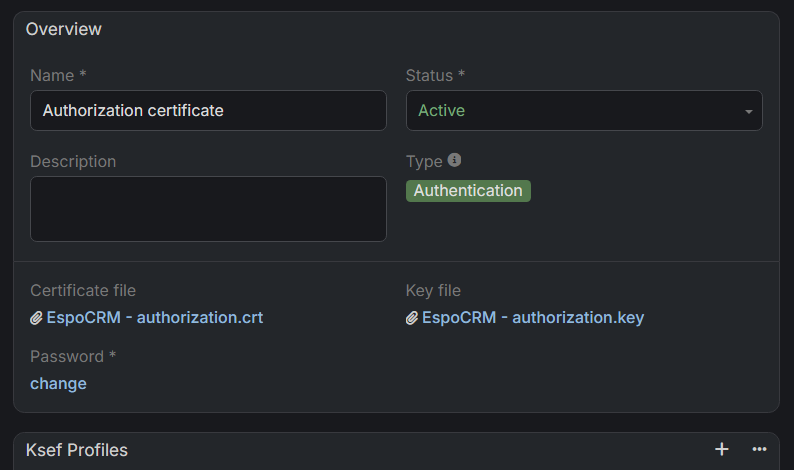

# :material-tools: Authorization

This guide explains how to configure authorization for the KSeF integration. You will learn how to generate security tokens and manage authentication certificates within EspoCRM to ensure a secure connection with the National e-Invoice System.

---

## :material-file-document-edit: Initial Access to KSeF (for non-JDG users)

If you have never logged in to KSeF and you do **not** operate as a sole proprietor (JDG), first submit the **ZAW-FA(3)** form in **e-Urząd Skarbowy (e-US)**.

### Where to find the form

In e-US, go to:

`Dokumenty > Złóż dokument > Zawiadomienie o nadaniu lub odebraniu uprawnień do korzystania z Krajowego Systemu e-Faktur (ZAW-FA)`

### Who can submit ZAW-FA(3)

* A natural person (to report unique data linked to a qualified electronic signature certificate).
* A general proxy for another natural person (same scope as above).
* A general proxy for a non-natural-person entity (grant/revoke permissions, including all permissions, and report unique data linked to the taxpayer’s qualified electronic seal certificate).
* An Organization Account User (UKO) for an organization (grant/revoke permissions, including all permissions, and report unique data linked to the taxpayer’s qualified electronic seal certificate).

---

## :material-lock-check: How to Generate a KSeF Token

1. Log in to the KSeF web application (environment links are provided below).
2. Navigate to the **Tokens** section.
3. Generate a new token and assign permissions to **issue** and **read** invoices.
4. Securely save the generated token and paste it into your **KSeF Profile** within EspoCRM.

!!! example "Example of a KSeF Token"
    `20270115-EC-7FA3B1D200-AB12345F6A-01|nip-987654321|a1b2c3d4e5f60718293a4b5c6d7e8f90123456789abcdef0123456789abcdef0`

---

## :material-certificate: How to Generate KSeF Certificates

!!! info "You will need two certificates"
    Please note that the KSeF system requires two distinct types of certificates:

    * **Authentication**: Used for verifying your identity when connecting to the system.
    * **Offline**: Used solely to verify the authenticity of the issuer and the integrity of invoices in offline mode.

To generate a new certificate, log in to the appropriate environment:

* **Production:** [https://ap.ksef.mf.gov.pl/web/](https://ap.ksef.mf.gov.pl/web/)
* **Demo:** [https://ap-demo.ksef.mf.gov.pl/web/](https://ap-demo.ksef.mf.gov.pl/web/)
* **Test:** [https://ap-test.ksef.mf.gov.pl/web/](https://ap-test.ksef.mf.gov.pl/web/)

Navigate to the **Certificates** section and request a new certificate. Ensure you select the correct type (**Authentication** or **Offline**).

Once the package is ready, you will receive a notification in EspoCRM containing a direct link to the certificate package.

---

## :material-plus-box: How to Add a KSeF Certificate to EspoCRM

1. Navigate to the **Administration** section.
2. Search for **KSeF Settings** and open it.
3. Select the **KSeF Profile** you wish to update.
4. Click the **Edit** button.
5. Set the **Authorization Type** to `Certificate`.
6. Link the appropriate certificate to the corresponding field.
    * *Note:* If you haven't uploaded the certificate to EspoCRM yet, click the **arrow icon** in the link field and select the option to create a **New KSeF Certificate**.
    * Upload your certificate and key files, and provide the password if applicable.
    * Click **Save** to link the certificate to the profile.
7. Repeat the process for the second certificate type.

> You can link a single certificate to multiple KSeF Profiles. Before proceeding, ensure the certificate status is set to **Active**.
