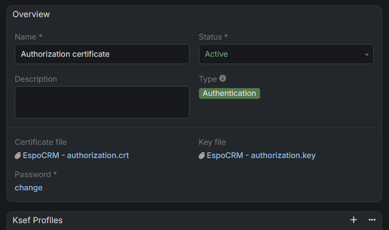

# :material-tools: Autoryzacja

Ten przewodnik wyjaśnia, jak skonfigurować autoryzację dla integracji KSeF. Dowiesz się z niego, jak generować tokeny bezpieczeństwa oraz zarządzać certyfikatami uwierzytelniającymi w EspoCRM, aby zapewnić bezpieczne połączenie z Krajowym Systemem e-Faktur.

---

## :material-file-document-edit: Pierwszy dostęp do KSeF (dla użytkowników niebędących JDG)

Jeśli nigdy wcześniej nie logowałeś się do KSeF i **nie** prowadzisz działalności jako jednoosobowy przedsiębiorca (JDG), najpierw złóż formularz **ZAW-FA(3)** w **e-Urzędzie Skarbowym (e-US)**.

### Gdzie znaleźć formularz

W e-US przejdź do:

`Dokumenty > Złóż dokument > Zawiadomienie o nadaniu lub odebraniu uprawnień do korzystania z Krajowego Systemu e-Faktur (ZAW-FA)`

### Kto może złożyć ZAW-FA(3)

* Osoba fizyczna (w celu zgłoszenia danych unikalnych powiązanych z certyfikatem kwalifikowanego podpisu elektronicznego).
* Pełnomocnik ogólny innej osoby fizycznej (w tym samym zakresie jak powyżej).
* Pełnomocnik ogólny podmiotu niebędącego osobą fizyczną (nadawanie i odbieranie uprawnień, w tym wszystkich uprawnień, oraz zgłaszanie danych unikalnych powiązanych z certyfikatem kwalifikowanej pieczęci elektronicznej podatnika).
* Użytkownik Konta Organizacji (UKO) dla organizacji (nadawanie i odbieranie uprawnień, w tym wszystkich uprawnień, oraz zgłaszanie danych unikalnych powiązanych z certyfikatem kwalifikowanej pieczęci elektronicznej podatnika).

---

## :material-lock-check: Jak wygenerować token KSeF

1. Zaloguj się do aplikacji internetowej KSeF (odnośniki do środowisk znajdują się poniżej).
2. Przejdź do sekcji **Tokeny**.
3. Wygeneruj nowy token i nadaj mu uprawnienia do **wystawiania** oraz **odczytu** faktur.
4. Bezpiecznie zapisz wygenerowany token i wklej go do swojego **profilu KSeF** w EspoCRM.

!!! example "Przykład tokenu KSeF"
    `20270115-EC-7FA3B1D200-AB12345F6A-01|nip-987654321|a1b2c3d4e5f60718293a4b5c6d7e8f90123456789abcdef0123456789abcdef0`

---

## :material-certificate: Jak wygenerować certyfikaty KSeF

!!! info "Potrzebne są dwa certyfikaty"
    Pamiętaj, że system KSeF wymaga dwóch odrębnych typów certyfikatów:

    * **Uwierzytelniający**: Służy do potwierdzania tożsamości podczas łączenia z systemem.
    * **Offline**: Służy wyłącznie do weryfikacji autentyczności wystawcy oraz integralności faktur w trybie offline.

Aby wygenerować nowy certyfikat, zaloguj się do odpowiedniego środowiska:

* **Produkcja:** [https://ap.ksef.mf.gov.pl/web/](https://ap.ksef.mf.gov.pl/web/)
* **Demo:** [https://ap-demo.ksef.mf.gov.pl/web/](https://ap-demo.ksef.mf.gov.pl/web/)
* **Test:** [https://ap-test.ksef.mf.gov.pl/web/](https://ap-test.ksef.mf.gov.pl/web/)

Przejdź do sekcji **Certyfikaty** i złóż wniosek o nowy certyfikat. Upewnij się, że wybierasz właściwy typ (**Uwierzytelniający** lub **Offline**).

Gdy pakiet będzie gotowy, otrzymasz w EspoCRM powiadomienie zawierające bezpośredni link do pakietu certyfikatu.

---

## :material-plus-box: Jak dodać certyfikat KSeF do EspoCRM

1. Przejdź do sekcji **Administracja**.
2. Wyszukaj **Ustawienia KSeF** i otwórz je.
3. Wybierz **profil KSeF**, który chcesz zaktualizować.
4. Kliknij przycisk **Edytuj**.
5. Ustaw **Typ autoryzacji** na `Certificate`.
6. Powiąż odpowiedni certyfikat z właściwym polem.
    * *Uwaga:* Jeśli certyfikat nie został jeszcze przesłany do EspoCRM, kliknij **ikonę strzałki** w polu powiązania i wybierz opcję utworzenia **nowego certyfikatu KSeF**.
    * Prześlij pliki certyfikatu i klucza oraz podaj hasło, jeśli jest wymagane.
    * Kliknij **Zapisz**, aby powiązać certyfikat z profilem.
7. Powtórz ten proces dla drugiego typu certyfikatu.

> Możesz powiązać jeden certyfikat z wieloma profilami KSeF. Przed kontynuowaniem upewnij się, że status certyfikatu jest ustawiony na **Aktywny**.
