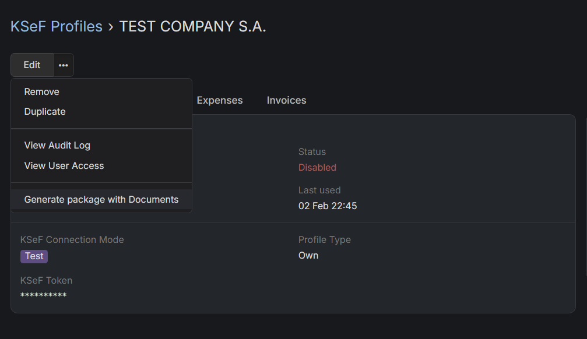

# Generate package with financial documents

## :material-download-box: How to download financial documents from previous month?

!!! info "Support only for XML invoices"
    Right now this feature only generate package with invoices which where issued via KSeF or downloaded from KSeF. If you decide to issue invoice without KSeF, it'll not be included in the package. That's because you're able to generate package only for specific KSeF profile for now. We're working on extending that feature.

1. Go to **Administration** section.
2. Search for "KSeF Settings" and click on it.
3. Choose KSeF Profile for which you want to generate a package with documents.
4. Click on horizontal three dots icon, next to Edit button and choose `Generate package with Documents` option from dropdown.

You'll be notified in EspoCRM notifications when package will be ready. There will be also a link to a package.
