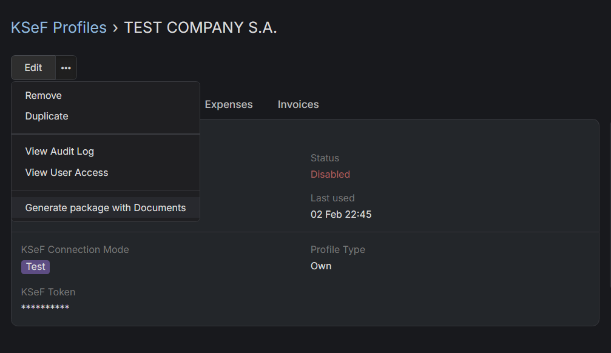

# Generowanie pakietu z dokumentami finansowymi

## :material-download-box: Jak pobrać dokumenty finansowe z poprzedniego miesiąca?

1. Przejdź do [Profili KSeF](https://dubas.pro/redirect/#KsefProfile).
2. Wybierz profil KSeF, dla którego chcesz wygenerować pakiet z dokumentami.
3. Kliknij na ikonę trzech poziomych kropek, obok przycisku Edytuj i wybierz opcję `Eksportuj faktury` z menu rozwijanego.
4. Wybierz okres, z którego chcesz pobrać faktury, domyślnie ustawiony jest na jeden miesiąc. Możesz również wybrać, czy chcesz pobrać tylko wydatki czy faktury.
5. Kliknij na **Eksportuj**

Będziesz powiadomiony w powiadomieniach EspoCRM, gdy pakiet będzie gotowy. Będzie tam również link do pakietu.
