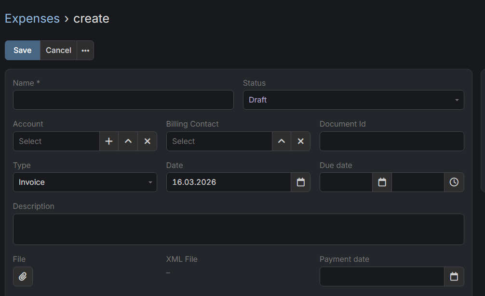

# Dubas KSeF Integration

## :material-information-outline: General Information
Dubas Ksef Integration is an extension developed by our company that enables seamless integration between EspoCRM and the KSeF system. With this extension, you can automatically download invoices from KSeF directly into EspoCRM, as well as issue invoices through KSeF using the Sales Pack functionality. This solution streamlines invoice management and ensures secure, efficient handling of financial documents within your CRM.

!!! tip "Purchase"
    Please contact us [via form](https://dashboard.dubas.pro/static/form/contact) if you'd like to order this extension.

### List of features

!!! warning "This product is new!"
    Please note that both this extension and the KSeF system are relatively new, and ongoing updates or changes to standards may occur. We are committed to adapting the integration as needed and supporting individual use cases to ensure continued compatibility and reliability.

- All your data remains secure within your EspoCRM instance. All communication occurs directly between your EspoCRM and the KSeF system. Our integration does not transmit any financial or client information to third parties.
- The integration automatically retrieves invoices issued by your contractors from KSeF based on your preferences.
- Received invoices are stored in Expenses entity which was created as compatible part of Sales Pack with Item List.
- You can also manually initiate the retrieval of invoices from KSeF at any time.
- The Expenses module can be used for all invoices, not just those from KSeF. You can manually enter expenses from other sources as needed.
- The integration enables you to send invoices issued in Sales Pack directly to KSeF.

### :material-map-marker-distance: Roadmap

- Authorization via certificates (required before 2027).
- Support for offline modes (requires certificates).
- Support for Credit Notes - only if Sales Pack entity will be compatible with KSeF.
- Adding batches support for invoices issuing.

## :material-playlist-check:  Requirements
- EspoCRM in version 9.2.0 or higher.
- Sales Pack in version higher than 3.x

## :material-book-plus-multiple: How to configure KSeF Profile?

You can configure multiple KSeF Profiles. Thanks to that you can handle multiple companies in one place.

1. Go to **Administration** section.
2. Search for "KSeF Settings" and click on it.
3. Create new KSeF Profile based on below specification.

#### :material-book-information-variant: Explanation of fields

**Overview**

- Name - value which will display everywhere, probably best option is to set name of the company.
- Status - set **Active** if you want to use it.
- Tax Id - enter here you NIP number. It cannot be changed after save.
- Type - choose environment for which you've created a token (below more information).
- Choose type of profile - If it's your company choose Own.
- Token - enter token generated in KSeF. More information below.

**Company details**

- Company name - Full name of a company, it'll be used for example for issued invoices.
- Address - Full address to be added on issued invoices.
- Email address & phone number - additional contact information on issued invoices.

**Expenses**

- Enable Expenses - decides whether invoices will be fetched to EspoCRM for this profile.
- Fetch since - decides from when invoices will be fetched.
- Create accounts for expenses - decides whether account will be automatically created if integration couldn't find account based on tax id.

## :material-cog-sync-outline: How to configure KSeF cron job?

1. Go to **Administration** section.
2. Click on Scheduled Jobs.
3. Create new Scheduled Job.
4. Choose task `Get Invoices From Ksef`.
5. Save.

By default it'll download automatically expenses from KSeF every 5 minutes for active profiles.

## :material-lock-check: How to get KSeF Token?

1. Login to KSeF web application (Below you have links to all environments).
2. Go to Token's section.
3. Generate new token with permissions to issue and read invoices.
4. Save generated token.

!!! example "Example of a token"
    `20270115-EC-7FA3B1D200-AB12345F6A-01|nip-987654321|a1b2c3d4e5f60718293a4b5c6d7e8f90123456789abcdef0123456789abcdef0`

## :material-server-network: KSeF Environments

- Production - https://ap.ksef.mf.gov.pl/web/
- Demo - https://ap-demo.ksef.mf.gov.pl/web/
- Test - https://ap-test.ksef.mf.gov.pl/web/

---

## Related articles

- [How to issue an invoice via KSeF?](./issue-invoice.md)
- [How to download package with financial documents?](./download-documents.md)
- [How to configure profile for KSeF in test environment?](./test-profile.md)
