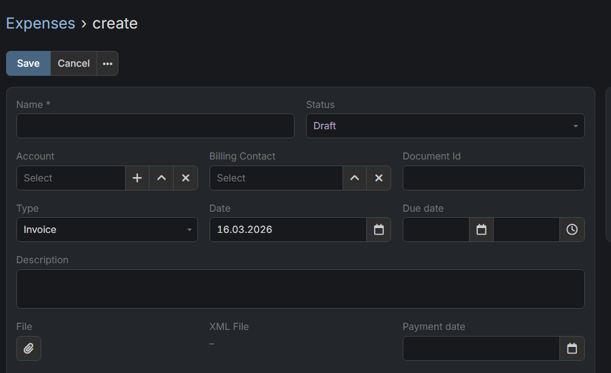

# Integracja Dubas KSeF

## :material-information-outline: Informacje ogólne

Integracja Dubas KSeF to dedykowane rozszerzenie, które umożliwia płynną komunikację między EspoCRM a Krajowym Systemem e-Faktur (KSeF). Dzięki temu rozszerzeniu możesz automatycznie pobierać faktury od kontrahentów z KSeF bezpośrednio do EspoCRM, a także wysyłać własne faktury do KSeF z wykorzystaniem funkcji Sales Pack. To rozwiązanie usprawnia zarządzanie dokumentami finansowymi i zapewnia bezpieczną oraz wydajną obsługę w Twoim CRM.

!!! tip "Zakup"
    Skontaktuj się z nami [przez formularz](https://dubas.pro/form/contact), jeśli chcesz zamówić to rozszerzenie.

### Najważniejsze funkcje

!!! warning "Ten produkt jest nowy!"
    Zarówno to rozszerzenie, jak i system KSeF są stosunkowo nowe, dlatego mogą pojawiać się aktualizacje oraz zmiany krajowych standardów. Zobowiązujemy się dostosowywać integrację do tych zmian i wspierać indywidualne przypadki użycia, aby zapewnić ciągłą kompatybilność oraz niezawodność.

* **Pełne bezpieczeństwo danych:** Wszystkie Twoje dane pozostają bezpieczne w instancji EspoCRM. Komunikacja odbywa się bezpośrednio między Twoim CRM a systemem KSeF. Nasza integracja nie przekazuje danych finansowych ani danych klientów do podmiotów trzecich.
* **Automatyczne pobieranie faktur:** Integracja automatycznie pobiera z KSeF faktury wystawione przez Twoich kontrahentów zgodnie z ustawionym harmonogramem i preferencjami.
* **Kompatybilność z Sales Pack:** Pobrane faktury są zapisywane w encji Wydatki (Expenses), zaprojektowanej z pełną zgodnością z Sales Pack oraz jego listą pozycji.
* **Ręczna synchronizacja:** W każdej chwili możesz ręcznie uruchomić pobieranie faktur z KSeF.
* **Ujednolicone zarządzanie wydatkami:** Moduł Wydatki można wykorzystywać do wszystkich faktur, nie tylko tych z KSeF. W razie potrzeby możesz ręcznie dodawać wydatki z innych źródeł.
* **Bezpośrednie wystawianie faktur:** Wysyłaj faktury wystawione w Sales Pack EspoCRM bezpośrednio do systemu KSeF.

### :material-map-marker-distance: Plan rozwoju

* :material-checkbox-marked-outline: Autoryzacja certyfikatami (wymagana przed 2027 r.).
* :material-checkbox-marked-outline: Obsługa rachunków bankowych.
* :material-checkbox-marked-outline: Obsługa wielu schematów KSeF.
* :material-checkbox-blank-outline: Obsługa trybów offline (wymaga autoryzacji certyfikatem).
* :material-checkbox-blank-outline: Obsługa faktur korygujących (zależna od kompatybilności encji Sales Pack z KSeF).
* :material-checkbox-blank-outline: Obsługa wsadowego przetwarzania wystawiania faktur.

---

## :material-playlist-check: Wymagania

* EspoCRM w wersji **9.3.0** lub nowszej.
* Sales Pack w wersji **4.x** lub nowszej.
* PHP (dla web i cli) w wersji **8.4** lub nowszej.

---

## Jak zacząć?

1. Kup i zainstaluj **[rozszerzenie Sales Pack](https://dubas.pro/link/sp)**
2. Zainstaluj rozszerzenie KSeF
3. [Skonfiguruj profil KSeF](./profiles.md#how-to-configure-a-ksef-profile)
4. [Skonfiguruj automatyczne pobieranie wydatków](#jak-skonfigurować-zadanie-cron-ksef)
5. [Dodaj opcjonalne pola do faktur](./invoices.md#how-to-set-additional-params-for-invoice)

**[Teraz możesz wystawić swoją pierwszą fakturę!](./invoices.md#how-to-issue-invoice-via-ksef)**

## :material-cog-sync-outline: Jak skonfigurować zadanie cron KSeF

1. Przejdź do sekcji **Administracja**.
2. Kliknij **Zaplanowane zadania**.
3. Utwórz nowe zaplanowane zadanie.
4. Wybierz zadanie `Get Invoices From Ksef`.
5. Kliknij **Zapisz**.

Domyślnie to zadanie automatycznie pobiera wydatki z KSeF co **5 minut** dla wszystkich aktywnych profili.

!!! note "Codzienne sprawdzanie"
    Zalecamy skonfigurowanie dodatkowego zaplanowanego zadania o nazwie **Daily Fetch Of Expenses From KSeF**. Prawidłowy harmonogram to `0 0 * * *`, czyli o 00:00.

---

## :material-server-network: Środowiska KSeF

* **Production:** [https://ap.ksef.mf.gov.pl/web/](https://ap.ksef.mf.gov.pl/web/)
* **Demo:** [https://ap-demo.ksef.mf.gov.pl/web/](https://ap-demo.ksef.mf.gov.pl/web/)
* **Test:** [https://ap-test.ksef.mf.gov.pl/web/](https://ap-test.ksef.mf.gov.pl/web/)

---

## Powiązane artykuły

* [Zarządzanie fakturami](./invoices.md)
* [Zarządzanie wydatkami](./expenses.md)
* [Jak pobrać paczkę z dokumentami finansowymi](./download-documents.md)
* [Jak skonfigurować profil dla środowiska testowego KSeF](./test-profile.md)
* [Jak zarządzać rachunkami i numerami NIP](./accounts.md)
