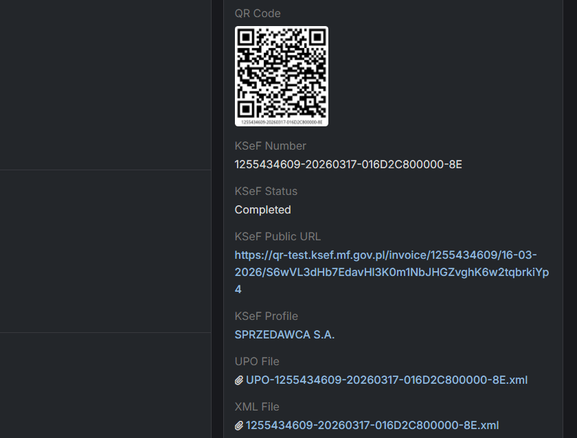

# Zarządzanie Fakturami



## :material-file-send: Jak wystawić Fakturę za pośrednictwem KSeF?

??? warning "Wymagany pakiet Sales Pack"
    Pamiętaj, że ta funkcja nie będzie działać, jeśli nie masz zainstalowanego rozszerzenia Sales Pack.

??? info "Najpierw włącz faktury"
    Ta funkcja będzie działać tylko, jeśli włączysz faktury w profilu KSeF (szczegóły powyżej).

!!! danger "Przejrzyj wystawioną fakturę!"
    Pamiętaj, że oprogramowanie może zawierać błędy. Sprawdź swoją konkretną konfigurację przy użyciu [profilu testowego](./test-profile.md) przed użyciem profilu KSeF w produkcji.

1. Przejdź do **Faktur**.
2. Utwórz nową Fakturę.
3. Wybierz Profil KSeF.
4. Kliknij na `Wyślij przez KSeF`
5. Jeśli wszystko jest w porządku, faktura zostanie zaplanowana do wysłania do KSeF.

Niestety nie możemy przesłać faktury do KSeF w ciągu kilku sekund, dlatego proces działa w tle. Po wystawieniu faktury pole KSeF Status zostanie ustawione na **Completed** (Ukończone).

### Kiedy przycisk `Wyślij przez KSeF` będzie widoczny?

Przycisk jest widoczny tylko wtedy, gdy spełnione są wszystkie następujące warunki:

- Widok rekordu **nie jest w trybie edycji**.
- Status faktury `status` **nie jest** jednym z: `Issued`, `Paid`, `Overdue`, `Confirmed`.
- `ksefStatus` to albo:
    - `null`, albo
    - string zawierający `"Error"`.
- `ksefProfileId` **nie jest** `null`.

Jeśli którekolwiek z tych warunków nie zostaną spełnione, przycisk będzie ukryty.

## :material-book-information-variant: Pola KSeF na fakturach

- `ksefNumber` - numer KSeF przypisany do faktury. Wymagane na wystawionych fakturach.
- `ksefStatus` - status dostarczenia faktury do KSeF.
- `ksefPublicUrl` - publiczny adres URL strony statusu faktury w KSeF.
- `ksefProfile` - profil używany do wystawienia faktury i przesłania do KSeF.
- `upoFile` - plik XML potwierdzający dostarczenie do KSeF.
- `xmlFile` - plik XML zawierający szczegóły faktury.

## :material-bank-plus: Jak ustawić dodatkowe parametry faktury?

Przejdź do menadżera layoutu i dodaj odpowiednie pola do widoku szczegółów:

- Dodatkowe Konta - możesz dodać konta stron trzecich do faktury i ustawić ich rolę
- Metoda Kasowa
- Odwrotne Obciążenie
- Mechanizm Podzielonej Płatności
- Typ Zwolnienia - możesz również ustawić `Opis Zwolnienia`
- Okres Istotny - jeśli chcesz określić inną datę niż wystawienie, wybierz `Datę Istotną` lub `Okres`. W takim przypadku dodaj również dodatkowe pola: `Data Dostarczenia lub Wykonania Usługi` lub/i `Data Początkowa Okresu` i `Data Końcowa Okresu`

## :material-currency-usd: Jak wystawiać faktury w różnych walutach?

1. Włącz dodatkowe [waluty w ustawieniach](https://dubas.pro/redirect/#Admin/currency)
2. Wprowadź odpowiednie [kursy walut](https://dubas.pro/redirect/#CurrencyRecord/list/fromSettings=true) dla każdej waluty - możesz to również robić automatycznie (sprawdź poniżej)
3. Podczas tworzenia nowej faktury, przed dodaniem czegokolwiek do listy pozycji, zmień walutę z PLN na inną

## :material-github: Jak automatycznie aktualizować kursy walut?

Możesz pobrać nasze darmowe rozszerzenie, aby utrzymywać aktualne kursy walut:
<a href="https://github.com/dubas-pro/ext-nbp-exchange-rates/releases">Rozszerzenie NBP</a>


## :material-qrcode-scan: Jak prawidłowo opisać fakturę PDF

!!! warning
    Upewnij się, że PDF wyświetla dokładne szczegóły, które są zgodne z informacjami wysłanymi do KSeF.

Jeśli chcesz dostarczyć klientowi wizualizację PDF faktury wystawionej za pośrednictwem KSeF, upewnij się, że PDF zawiera wartości zgodne z danymi wysłanymi do KSeF.

Uwzględnij co najmniej:

- **Numer KSeF** - `{{ksefNumber}}`
- **Link publiczny do strony faktury KSeF** - `{{ksefPublicUrl}}`
- **Kod QR dla publicznej strony faktury KSeF** `{{qrCodeId}}`

Dla faktur wystawionych w **trybie offline**, uwzględnij dodatkowy (drugi) kod QR wymagany do identyfikacji/weryfikacji offline.

### Jak wydrukować kod QR na PDF?

Możesz użyć kodu kreskowego wygenerowanego przez integrację KSeF, który jest przechowywany na fakturze (pole `qrCodeId`), lub możesz wygenerować własny kod QR ze łączem do dostosowania projektu kodu kreskowego:


```handlebars
{{barcodeImage ksefPublicUrl_RAW type='QRcode' width=60 height=60 fontsize=14 text=false padding=2}}
```
