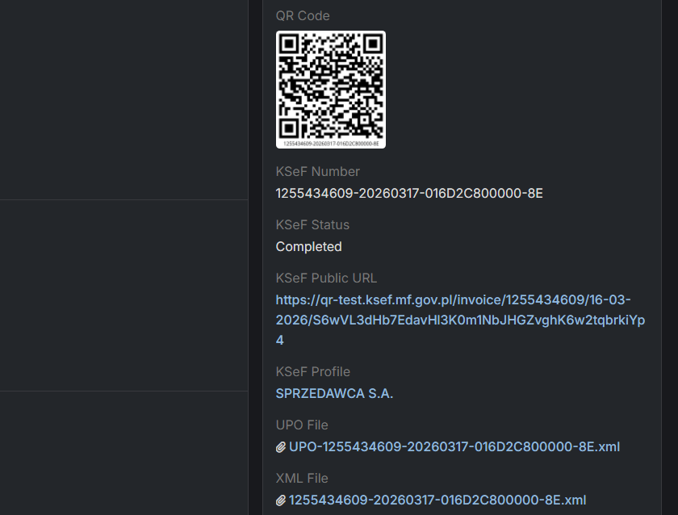

# Issue an invoice with KSeF

## :material-file-send: How to issue Invoice via KSeF?

!!! danger "Sales Pack required"
    Please keep in mind that feature will not work if you don't have Sales Pack extension.

!!! info "Enable invoices first"
    This feature will only work if you enable invoices in KSeF profile (details above).

1. Go to **Invoices**.
2. Create new Invoice.
3. Please make sure that before you change to **Issued** or **Confirmed**, you choose KSef Profile.
4. After everything is fine, invoice will be scheduled for sending to KSeF.

Unfortunatelly we can't pass invoice to KSeF in few seconds, that's why it's working in background. After invoice will be issued, field KSeF Status will be set to **Completed**.

### :material-book-information-variant: KSeF fields in invoices

- `ksefNumber` - KSeF number assigned to an invoice. Required on issued invoices.
- `ksefStatus` - status of invoice delivery to KSeF.
- `ksefPublicUrl` - public url to status page of invoice in KSeF.
- `ksefProfile` - profile which is used to issue an invoice and pass to KSeF.
- `upoFile` - XML file which confirm delivery to KSeF.
- `xmlFile` - XML file which contains invoice details.

