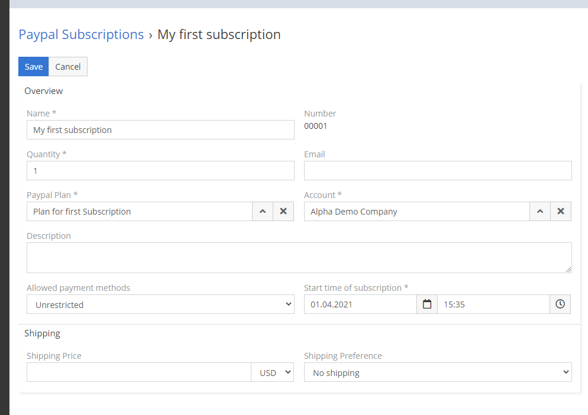

Die PayPal-Integration wurde ursprünglich für den internen Einsatz in unserem Unternehmen entwickelt. Nach vielen Monaten der Entwicklung dieser Erweiterung und internen Tests haben wir uns entschieden, die PayPal-Integration als Erweiterung zu veröffentlichen.

!!! tip "Order Now"
    Sie können diese Erweiterung in unserem [Marktplatz](https://devcrm.it/product/paypal/) kaufen.

## Demo

Sie können einige Funktionen dieser Erweiterung in unserer öffentlichen Demo testen. Gehen Sie zu [demo.devcrm.it](https://demo.devcrm.it) und melden Sie sich an:

- Username: **paypal**
- Password: **dubas**

## Requirements

- EspoCRM in Version 6.0.0 oder höher.
- PHP in Version 7.2 oder höher.
- Öffentlich erreichbare EspoCRM-Instanz – sie wird benötigt, da PayPal Webhooks verwendet, um einige Informationen zu übertragen.
- SalesPack-Erweiterung, wenn Sie PayPal-Rechnungen verwenden möchten.

## Installation

1. Melden Sie sich in Ihrem EspoCRM an und gehen Sie zum Bereich Administration.
2. Gehen Sie zum Bereich Extensions.
3. Installieren Sie die Erweiterung, die Sie von uns erhalten haben.

## Setup

1. Gehen Sie zu **Administration > Integrations**.
2. Wählen Sie die PayPal-Integration aus.
3. Aktivieren Sie die PayPal-Integration.
4. Öffnen Sie die PayPal-Website [My apps&credentials](https://developer.paypal.com/developer/applications).
5. Wählen Sie die Umgebung (Sandbox/Live) aus.
6. Klicken Sie auf die Schaltfläche **Create app**.
7. Geben Sie den Namen der App ein.
8. Kopieren Sie die **Client ID** und fügen Sie sie in Ihren Einstellungen für die PayPal-Integration ein.
9. Kopieren Sie das **Secret** und fügen Sie es in Ihren Einstellungen für die PayPal-Integration ein.
10. Wählen Sie die Umgebung aus – sie muss mit der zuvor im zweiten Schritt ausgewählten identisch sein.
11. Speichern Sie die Einstellungen.
12. Gehen Sie zu **Administration > PayPal Webhooks**.
13. Erstellen Sie einen neuen Webhook. Geben Sie einen Namen ein, wählen Sie die gewünschten Events aus, setzen Sie den Status auf **Activate**, und lassen Sie das Feld URL leer.
14. Speichern Sie den Webhook.

Jetzt können Sie PayPal in Ihrem EspoCRM verwenden. Sie können PayPal-Entitäten zu Ihrem Menü hinzufügen.
