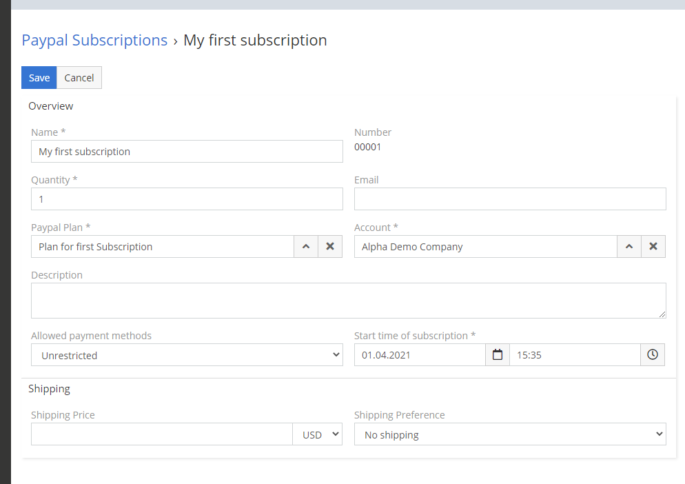

# Dubas Paypal Integration for EspoCRM

Paypal Integration was originally developed for internal use within our company. After many months of developing this extension and running internal tests, we decided to release the Paypal integration as an extension. 

!!! tip "Purchase online"
    You can purchase this extension in our [marketplace](https://devcrm.it/paypal).

## :material-cube-scan: Demo instance
You can check few features of this extension on our public demo. Go to [demo.devcrm.it](https://demo.devcrm.it) and login:

Username: **paypal**  
Password: **dubas**

## :material-playlist-check:  Requirements
- EspoCRM in version 6.0.0 or higher.
- PHP in version 7.2 or higher.
- Publicly available EspoCRM instance – it’s required because Paypal use webhooks to transfer some information.
- SalesPack extension if you want to use Paypal Invoices.

## :material-view-grid-plus: Installation
1.	Log in to your EspoCRM and go to Administration section.
2.	Go to section Extensions.
3. Install extension which you received from us.

## :material-tune: Initial configuration
1.	Go to **Administration > Integrations**.
2.	Choose Paypal integration.
3.	Enable Paypal integration.
4.	Open [My apps&credentials](https://developer.paypal.com/developer/applications) Paypal website. 
5.	Choose environment(Sandbox/Live).
6.	Click on buton **Create app**.
7.	Enter name of the app.
8.	Copy **Client ID** and paste it in your Paypal integration settings.
9.	Copy **Secret** and paste it in your Paypal integration settings.
10.	Choose environment – it must be the same as you selected before in the second step.
11.	Save settings.
12.	Go to **Administration > Paypal Webhooks**.
13.	Create new webhook. Add name, choose events which you want to use, choose status **Activate**, and field URL leave empty.
14.	Save webhook. 

Now you can start using Paypal in your EspoCRM. You can add Paypal entities to your menu.
