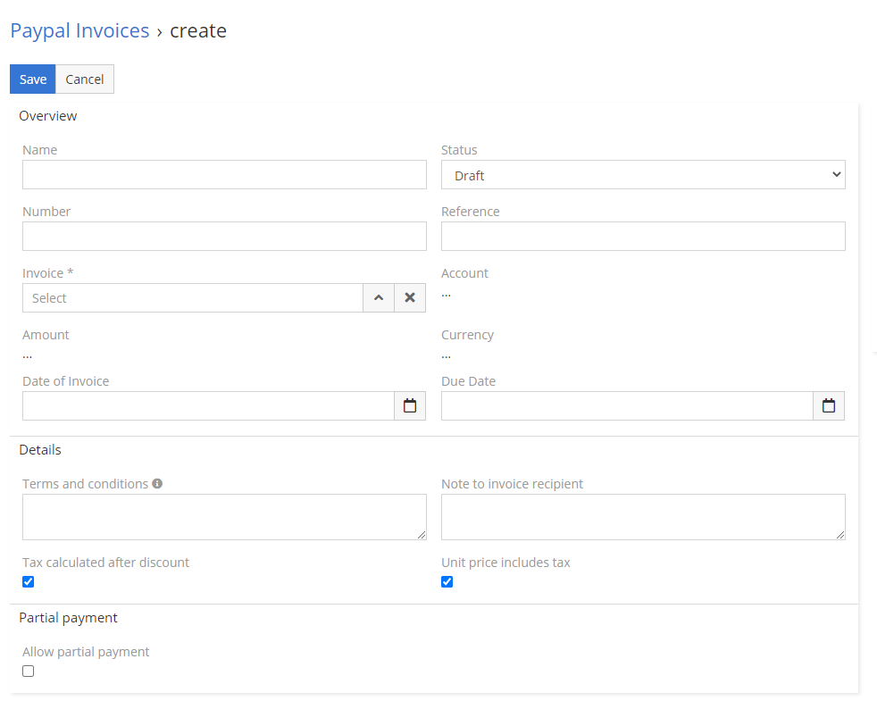
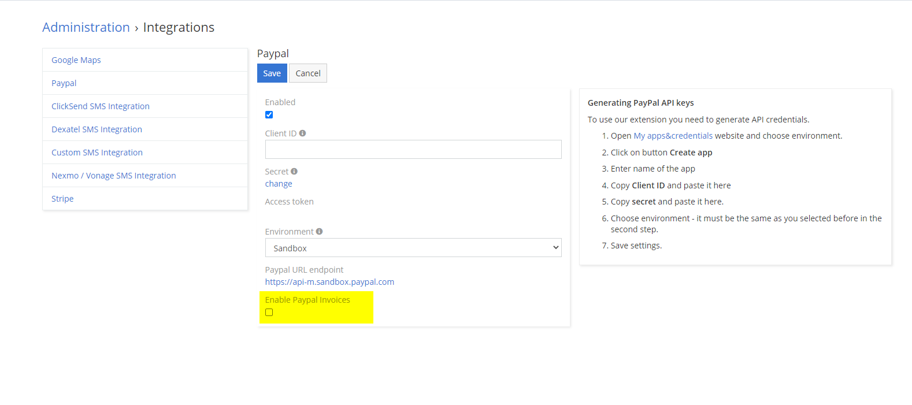

# PayPal Invoices

You might need to activate the PayPal Invoice option in your PayPal integration settings.

## :material-book-plus-multiple: How to create your first PayPal Invoice?

!!! warning "Enable PayPal Invoices in the settings first"
    If you can't find the PayPal Invoices entity in your EspoCRM, refer to [How to enable PayPal Invoices](#how-to-enable-paypal-invoices).

1. Go to **PayPal Invoices**.
2. Fill mandatory fields. You can read more about fields below in section **Explanation of fields**.
3. Save with **Draft** status to fetch all information from invoice.
4. Change status to **Register in PayPal** and save.
5. After status of your invoice change to **Registered in PayPal**, send your customer URL for recipient.

## :material-video-box: Video Presentation

## :material-folder-information-outline: Explanation of fields

1. **Invoice** – link to invoice from SalesPack.
2. **Number** – unique numer of invoice. Can’t create two invoices with same number.
3. **Reference** - the reference data.
4. **Date of Invoice** – date when invoice should be issued.
5. **Due Date** – due date of invoice.
6. **PayPal Id** – id assigned by PayPal.
7. **Direct URL** – URL for api actions.
8. **Invoicer view URL** – URL for invoicer.
9. **Recipient view URL** – URL for recipient.
10. **Note to invoice recipient** – note to the invoice recipient. Also appears on the invoice notification email.
11. **Private memo** – private bookkeeping memo for the user.
12. **Terms and conditions** – terms for specific invoice.
13. **Currency** – currency of invoice.
14. **Allow Tip** – allow customer to send a tip.
15. **Allow partial payment** – allow customer to pay in rates.
16. **Account** – link to specific account.
17. **Invoice Items** – linked items from invoice.
18. **Status** – check available statuses below.
19. **Amount** – amount of invoice.
20. **Tax calculated** after discount
21. **Unit price includes tax**
22. **Minimum partial payment** – minimal amount.

## :material-form-dropdown: Clarification of statuses

1. **Draft** – EspoCRM will not send any information to PayPal on this stage. Great option to prepare invoices for the future.
2. **Register in PayPal** – EspoCRM at this stage will send all information to PayPal.
3. **Registered in PayPal** – invoice with this stage is registered in PayPal and can be paid.
4. **Pending for PayPal response** – invoice pending for confirmation of action from PayPal.
5. **Cancel** – EspoCRM with this status will send request for cancellation to PayPal.
6. **Cancelled** – PayPal confirmed cancellation of invoice.
7. **Paid** – invoice is paid.
8. **Remove from PayPal** – EspoCRM will send request for removal of invoice to PayPal.
9. **Removed from PayPal** – PayPal confirmed removal of invoice.

## How to enable PayPal Invoices

!!!info ""
    To enable PayPal Invoices you have to install [Sales Pack](https://www.espocrm.com/extensions/sales-pack/) first.

1. Go to **Administration -> Integrations**.
2. Choose **PayPal**.
3. Check checkbox **Enable PayPal Invoices**.

