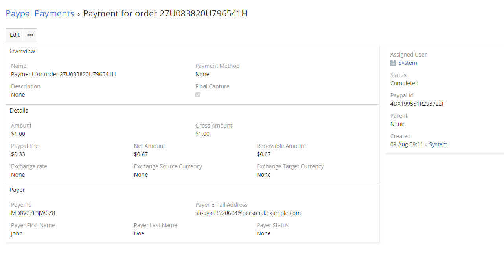

# PayPal Payments

PayPal Payments are used in conjunction with PayPal Invoices and PayPal Transactions at this time. PayPal Paymant module does not require any action from your side at the moment. All you need to do is use `CHECKOUT.ORDER.APPROVED` or `INVOICING.INVOICE.PAID` webhooks. Thanks to that, when your client pay for invoice or transaction, EspoCRM will automatically retrieve the related payment information and place it in the PayPal Payments entity.

!!! warning
    This functionality is available from 0.3 version.

In the future we also plan to add support for the Payments, Payouts and Refunds module.

If you want to configure webhook, check [How to create your first PayPal Webhook](webhooks.md#how-to-create-your-first-paypal-webhooks) tutorial.
