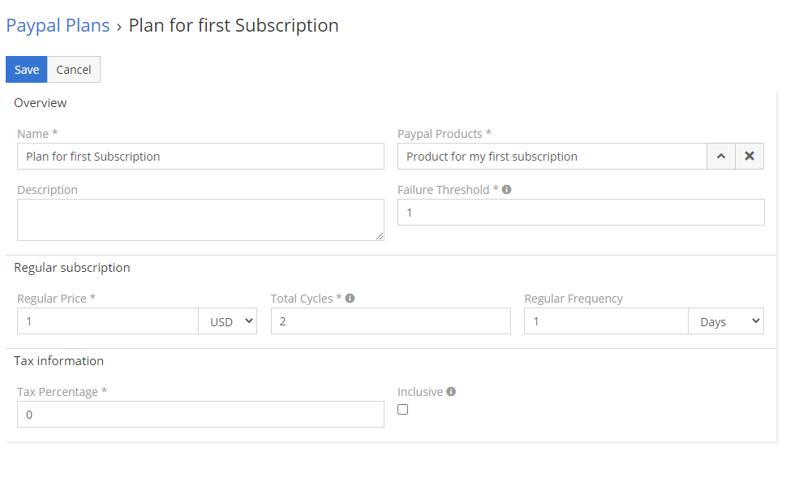

# PayPal Plans

## :material-book-plus-multiple: How to create your first PayPal Plan?

1. Go to **PayPal Plans**.
2. Fill all mandatory fields like name, paypal products etc. Most of them are already pre-filled – you can read more about fields below.
3. Switch **Status** to **Register in PayPal**.
4. Save.

!!! warning ""
    Please remember, that you have to activate PayPal Plan, before you'll be able to use this PayPal Plan in PayPal Subscription. To actiavte PayPal Plan, after registration of PayPal Plan, change status to **Activate**

## :material-video-box: Video Presentation

## :material-folder-information-outline: Explanation of fields

1. **Name** – name of plan, will be available in PayPal Plan list.
2. **PayPal Product** – choose which Product should be in this plan.
3. **Description** – optional description of plan.
4. **Failure Threshold** – The maximum number of payment failures before a subscription is suspended.
5. **Preferences** – custom preferences for plan.
   1. **Trial** – you can let your customers to test your services.
   2. **Setup fee** – you can charge your client with setup fee.
   3. **Automatically bill the outstanding amount** - Indicates whether to automatically bill the outstanding amount in the next billing cycle.
6. **Setup Fee** – initial setup fee.
7. **Action in case setup fee failure** – action to take on the subscription if the initial payment for the setup fails.
   1. **Continue** - Continues the subscription if the initial payment for the setup fails.
   2. **Cancel** - Cancels the subscription if the initial payment for the setup fails.
8. **Regular Price** – how much each rate will cost.
9. **Total Cycles** – how many times PayPal should chargé your client with regular price.
10. **Regular Frequency** – how ow often your customer should be billed.
11. **Tax Percentage** – amount of tax.
12. **Inclusive** - Indicates whether the tax was already included in the billing amount.

## :material-form-dropdown: Clarification of statuses

1. **Draft** – on this stage your plan can’t be use in subscriptions. It’s useful if you want to prepare plans for the future.
2. **Register in PayPal** – on this stage EspoCRM will send all information to PayPal and wait for registration.
3. **Registered in PayPal** – EspoCRM received confirmation through webhook from PayPal.
4. **Activate** – after you register your plan in PayPal, you have to activate plan by switching status to Activate.
5. **Active** – that’s mean that EspoCRM received information through webhook from PayPal about activation. Now you can use this plan in subscriptions.
6. **Deactivate** – this status will deactivate your plan.
7. **Inactive** – EspoCRM received information through webhook about deactivation.
8. **Waiting for response from PayPal** – that’s mean that EspoCRM wait for confirmation from PayPal.
