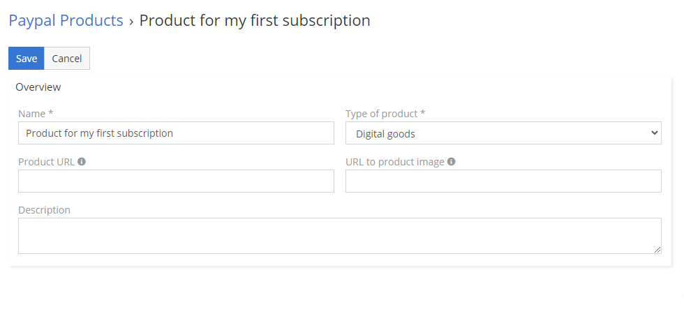

# Paypal Products

Plans Paypal Products, Paypal Plans are used in Paypal Subscriptions. You can’t create Paypal Plan without Paypal Product, and you can’t create Paypal Subscription without Paypal Plan. 

## How to create your first Paypal Product?
1.	Go to **Paypal Products** entity. 
2.	Create new **Paypal Product**.
3.	Fill fields Name and Type of product. Other fields are optional. 
4.	Change Status to **Register in Paypal**.
5.	Save.

That’s all. You should almost immediately see URL to your produkt in Paypal. After few minutes Webhook should receive information from Paypal. After that status will change to **Registered in Paypal**.
