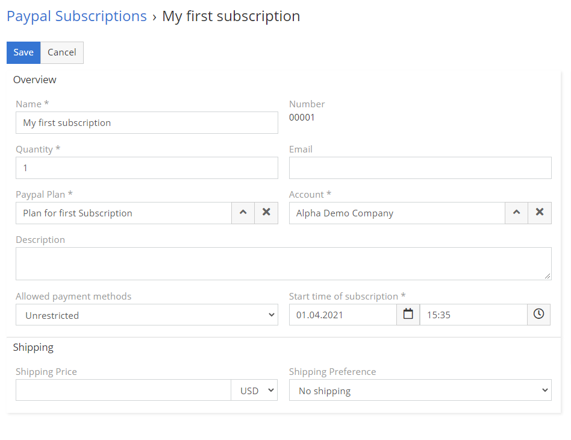

# PayPal Subscriptions

## :material-book-plus-multiple: How to create your first PayPal Subscription?

1. Go to **PayPal Subscription**.
2. Create new **PayPal Subscription**.
3. Fill all mandatory fields. Below you can find fields explanation.
4. Change **Status** to **Confirmed**. Below you can find status explanation.
5. Save.

## :material-folder-information-outline: Explanation of fields

1. **PayPal Plan** – link specific PayPal Plan to a subscription.
2. **Account** – link account to a subscription.
3. **Approve URL** – URL for a customer, where he can approve subscription.
4. **Quantity** – quantity of the product in the subscription.
5. **Shipping Country Code** – field where you have to choose customer country. It’s because PayPal require country code in different format. To make sure that you’ll not receive an error, we’ve created new field for that.
6. **Shipping Price** – Optional shipping price.
7. **Number** – Internal number of subscription.
8. **Shipping Preference** – how you want to deliver goods to your customer.
   1. **No shipping** – for services and virtual goods.
   2. **Get address from PayPal** – paypal will send you customer address.
   3. **Set own address** – you can define own address.
9. **Allowed payment methods** – you can choose how customer should pay.
   1. **Unrestricted** – accepts any type of payment from the customer.
   2. **Only immediate payment** – accepts only immediate payment from the customer. For example, credit card, PayPal balance, or instant ACH. Ensures that at the time of capture, the payment does not have the `pending` status.
10. **PayPal Subscription Id** – id of subscription in PayPal system.
11. **Start time of subscription** – when you want to start subscription period. It have to be date and time from the future.
12. **Shipping Address** – where you want to deliver goods to customer.
13. **Reason Of Cancellation** – don’t need explanation.
14. **Reason Of Suspension** – don’t need explanation.

## :material-form-dropdown: Clarification of statuses

1. **Draft** – EspoCRM on this stage will not send any information to PayPal. It’s great option if you want to prepare subscription for the future.
2. **Confirmed** – on this stage EspoCRM will send all information about Subscription to PayPal.
3. **Pending for approval** – subscription will wait until customer confirm through URL.
4. **Approved** – customer has approved the subscription.
5. **Activate** – EspoCRM will send request of activation to PayPal.
6. **Active** – subscription is active.
7. **Suspend** – EspoCRM will send request of suspension to PayPal.
8. **Suspended** – PayPal confirmed suspension of subscription.
9. **Cancel** – EspoCRM will send request of cancellation to PayPal.
10. **Cancelled** – PayPal confirmed cancellation of subscription.
11. **Expired** – subscription is expired.

## Explanation of filters

1. **Actual** – filter will show all subscriptions which are in status:
   1. Draft
   2. Confirmed
   3. Pending for approval
   4. Approved
   5. Active
   6. Activate
2. **Inactive** - filter will show all subscriptions which are in status:
   1. Suspend
   2. Suspended
   3. Cancel
   4. Cancelled
3. **Expired** - filter will show all subscriptions which are in status:
   1. Expired
