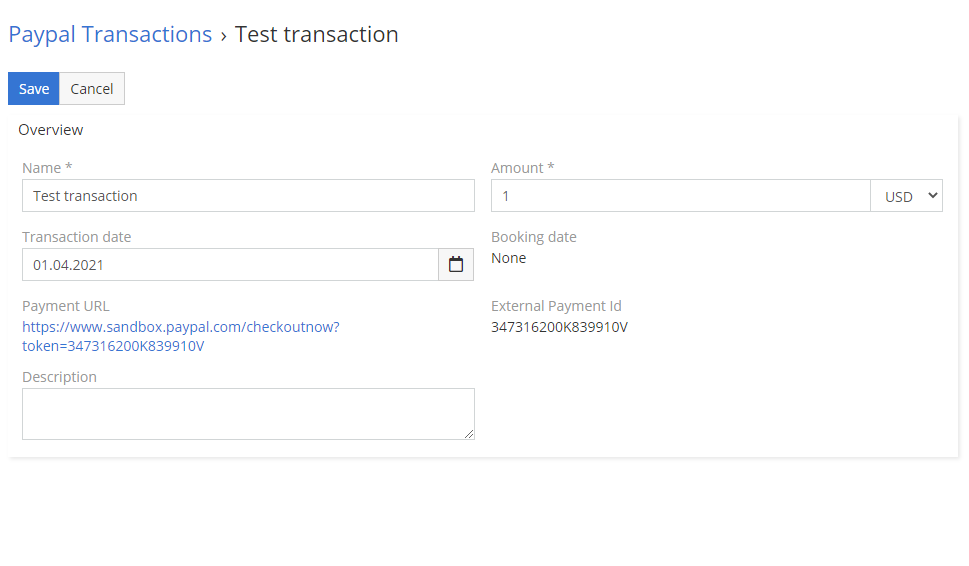

# Paypal Transactions

## How to create your first Paypal Transaction?
1.	Go to **Paypal Transactions** entity in your EspoCRM.
2.	Create new **Paypal Transaction**.
3.	Fill field name and amount. Field status switch to Register.

That’s it. After that you should see Payment URL like on the image above. This image you should send your customer. After your customer pay, status of transaction change to **Paid**. If he decide to cancel transaction, status of Paypal Transaction record change to **Failed**.

