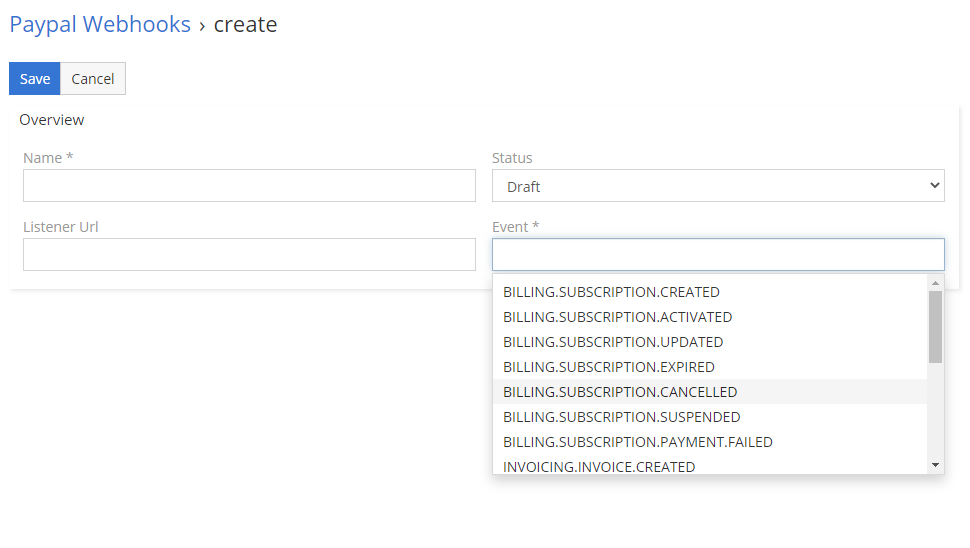

# Paypal Webhooks

## How to create your first Paypal Subscription?
1.	Go to **Paypal Webhooks** in Administration section.
2.	Create new **Paypal Webhook**.
3.	Fill name, choose events which you want to use, change status to **Activate** and leave Listener Url empty.
4.	Save.
Now you’re ready to receive information about events in Paypal.
## Explanation of fields
1.	**Status** – status of webhook. You can check clarification of statuses below.
2.	**Event** – events after which Paypal will send information to EspoCRM.
3.	**Listener Url** – automatically generate URL for webhooks.
4.	**Direct Url** – Direct URL for webhook actions.
5.	**Webhook Id** – ID assigned by paypal.
6.	**Paypal Webhook Records** – linked webhook records(subentity).
## Clarification of statuses
1.	**Draft** – EspoCRM on this stage will not send any information to Paypal. 
2.	**Activate** – EspoCRM will send all information about webhook to Paypal.
3.	**Active** – on this stage webhook is active.
4.	**Remove** – EspoCRM will send request for removal to Paypal.
5.	**Removed** – this stage mean that Paypal removed webhook.
6.	**Failed** – this stage mean that Paypal couldn’t register webhook.
