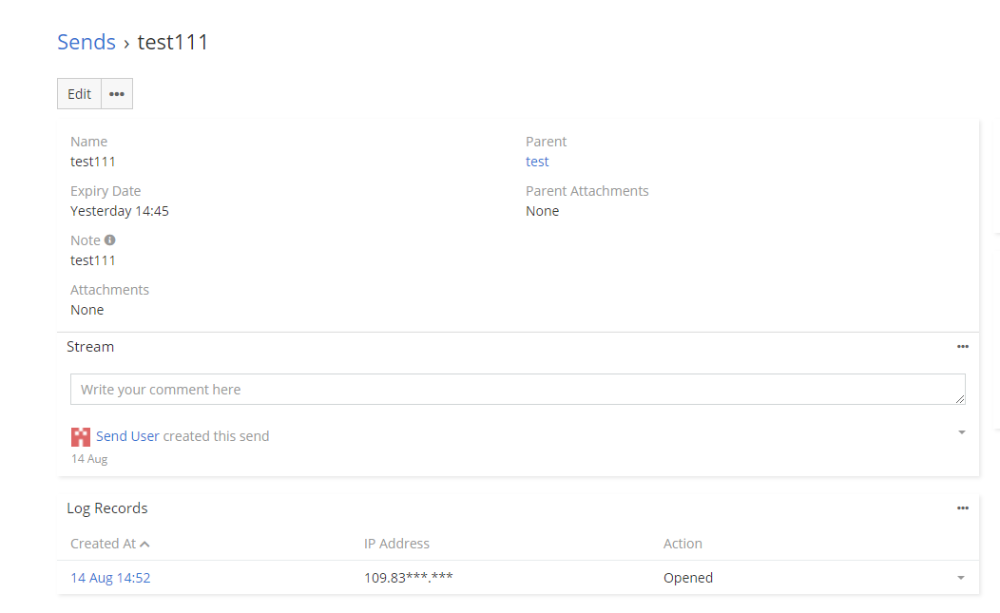

# Dubas Send Extension

## :material-information-outline: General Information
Dubas Send is an extension that will allow you to securely share files or text with specific people. With this extension you will be able to decide for how long you want to share specific information. The shared information can be accessed through a secure link that will last as long as you decide.
!!! info
    There is a product page for this extension: [devcrm.it/send](https://devcrm.it/send)

## :material-playlist-check:  Requirements
- EspoCRM in version 6.1.0 or higher.
- PHP in version 7.3 or higher.
- Publicly available EspoCRM instance – otherwise your customers will not be able to access.

## :material-book-plus-multiple: How to share something with customer?
1. Go to **Send**.
2. Create new Send.
3. Choose parent record from which you want to share attachments, choose attachment from already uploaded attachments, attach new attachments or just enter a note.
4. Save.

That's it. Now you can send generated url to your customer.

## :material-cube-scan: Demo
You can check this extension on our demo instance: [demo.devcrm.it](https://demo.devcrm.it)  
Username: **send**  
Password: **dubas**

## :material-video-box: Video Presentation

  <iframe width="1280" height="400" src="https://www.youtube.com/embed/Jrw-05MuTQg" frameborder="0" allowfullscreen></iframe>

## :material-folder-information-outline: Explanation of fields
1. **Access Token** - This field contain generated token.
2. **Attachments** - You can manually attach in this field new attachments.
3. **Expiry Date** - This field define how long send should be available.
4. **Language** - Language of website with attachments.
5. **Note** - You can enter note for your customer.
6. **Parent** - You can choose from which record you want to share attachments.
7. **Parent Attachments** - This field contain list of attachments. Especially usefull when you decide to share files from parent record. Then this field will contain all files from parent record.
8. **Public URL** - URL which is generated after creation of record. You can send it to your customer.