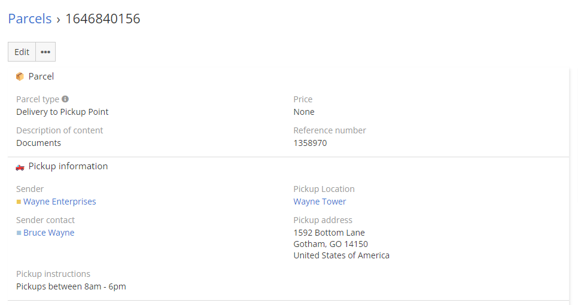

# Dubas Shipping Manager

Shipping manager is a free extension that allows you to manage your shipping company. It includes basic functionality that shows how information about shipments and deliveries should be stored. It will certainly allow small companies to enter data according to proper standards, and if you find that your company needs something extra, you can order such functionality from us. Shipping manager is one of many extensions that we plan to release for many industries. This is to support the EspoCRM community and encourage more companies to use this great product.

## :material-playlist-check:  Requirements
EspoCRM in version higher than 7.0.0. 

## :material-book-plus-multiple: Getting started
1. Open our website [https://devcrm.it/shipping-manager](https://devcrm.it/shipping-manager) and download installer;
2. Login to your EspoCRM as admin;
3. Go to admin section and open extensions page;
4. Choose installer from you computer and start installation process;
5. Go to Administration > User Interface and add Parcels, Packages and Parcel Locations entities to your Tab List. You can group them as we did on demo into one tab group.

## :material-cube-scan: Demo instance
You can test Time Tracker extension on our demo. Login to [demo.devcrm.it](https://demo.devcrm.it) using credentials:  
Username: **shipping**  
Password: **dubas**

## :material-video-box: Video Presentation

  <iframe width="1280" height="400" src="https://www.youtube.com/embed/oSyxV23u5pE" frameborder="0" allowfullscreen></iframe>

## :material-lifebuoy: Support
This extension is shared without any support. Extension is available as it is.
If you want to order some service, all information about us you can find on our website [https://devcrm.it/](https://devcrm.it/).