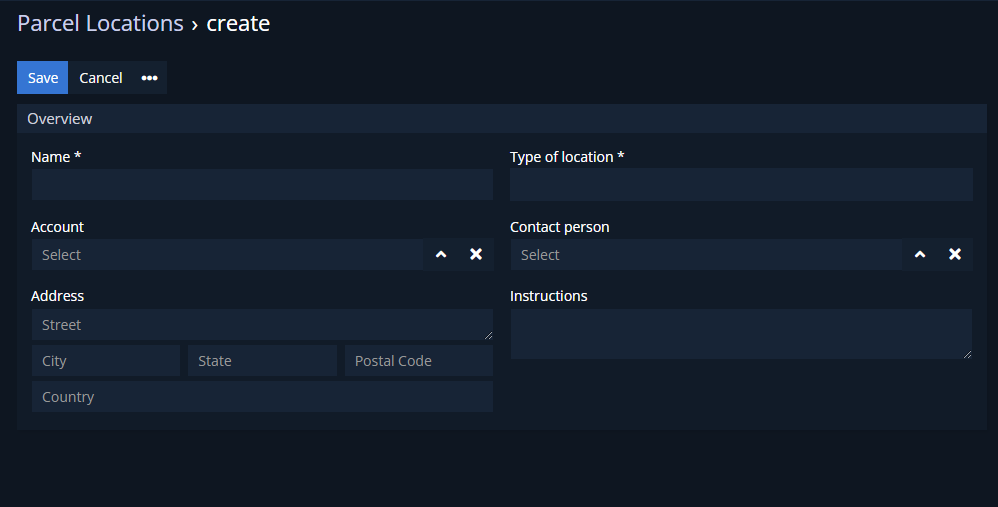

# Dubas Locations

Entity which allow to predefine locations. Thanks to this entity, you can save locations which you'll use in the future. You can define not only address, but also contact person and instructions for specific location. Thanks to additional entity, you'll be able to check what parcels was proceed through this location.

## :material-book-plus-multiple: How to create your first Paypal Plan?
1.	Go to **Locations** entity.
2.	Create new Location.
3.  Provide all information.
5.  Save.

## :material-folder-information-outline: Explanation of fields
1. **Account** - to which account location is assigned. Link to Accounts entity. 
2. **Contact person** - contact person for specific location. Link to Contacts entity.
3. **Number** - number of location. Generated automatically.
4. **Status** - status of location. Unavailable locations will not be visible in Parcels.  
    a. Available  
    b. Unavailable
5. **Instructions**
6. **Type of location** - type of location, one place can have more than one type.  
    a. Pickup  
    b. Delivery  
    c. Pickup Point  
7. **Address** - location of place.
8. **Sent Parcels** - information about linked parcels.
9. **Delivered Parcels** - information about linked parcels.