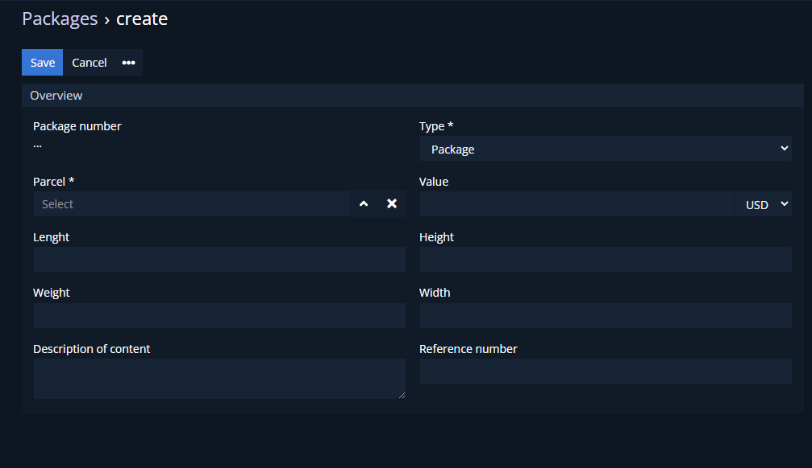

# Dubas Package Statuses

Entity which will allow you to change status of packages. You can change status of one package directly from Package record or you can change status of many packages. It's proper way to store statuses history and manage them in easy way.

## :material-book-plus-multiple: How to create your first PayPal Plan?
1.	Go to **Packages** entity.
2.	Choose package for which you want to set new status.
3.	Click on blue button in top right corner **Change status**.
4.  Choose new status.
5.  Save.

!!! warning
    If you change status or packages field after creation, it'll apply to all packages **again**.

## :material-folder-information-outline: Explanation of fields
1. **Packages** - choose to which packages status should be applied.
2. **Status** - choose status of packages.
    a.	**New** - package was created
    b.	**Package accepted** - package was accepted by personel
    c.	**Collected** - package was collected from sender
    d.	**Shipped** - package was shipped
    e.	**In transit** - package in transit
    f.	**Arrived at destination** - package arrived at destination, for example warehouse
    g.	**Out for delivery** - package is in delivery
    h.	**Ready to Pickup** - package waiting for pickup(only if delivery is to Pickup Point)
    i.	**Delivered** - Delivered/picked by client from Pickup Point
    j.	**Unsuccessful delivery attempt** - courier couldn't deliver package to the client
    k.	**Returned to sender** - package was returned to sender
