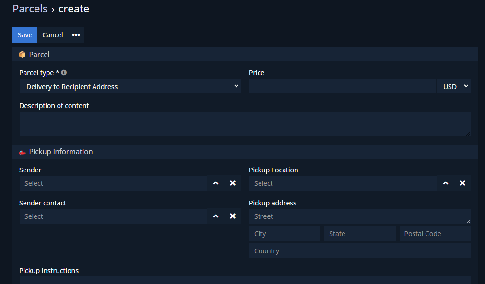

# Dubas Parcels

Entity which contain main information about whole parcel. After you create parcel, you'll be able to add packages to this parcel. Thanks to that you can have many packages related to one parcel.

## :material-book-plus-multiple: How to create your first PayPal Plan?
1.	Go to **Parcels** entity.
2.	Fill all mandatory fields like sender, recipient etc.
3.	Save.

## :material-folder-information-outline: Explanation of fields

1. **Parcel number** - it's actually the `name` field which is the main field of the record. It'll be filled automatically after save by our script with timestamp. Thanks to that number will be unique.
2. **Parcel type** - you can choose do you want to deliver parcel to the Pickup Point or to the Recipient address directly.
    a.	**Delivery** – delivery to Recipient Address.
    b.	**Pickup** – delivery to Pickup point.
3. **Sender** - link to Accounts entity.
4. **Pickup Location** - link to Locations entity. If you choose Sender first, you'll see filtered Locations which belongs to Sender, have status Available and are in type Pickup.
5. **Sender contact** - link to Contacts entity. Can be filled automatically if you choose location with Contact person.
6. **Pickup address** - address from where parcel should be collected. Can be populated from Location if filled. You can also enter address manually.
7. **Pickup instructions** - instructions related to pickup. Can be populated from Location if filled.
8. **Recipient** - account to which parcel should be delivered. Link to Accounts entity.
9. **Delivery Location** - location to which parcel should be delivered. Link to Locations entity. Don't have to be filled, but if you'll choose Recipient, Locations panel will should you filtered Locations related to Recipient with status Available and proper type.
10. **Contact** - person which should be contacted in case. Link to Contacts entity, can be populated from Location if filled.
11. **Delivery address** - address where parcel should be delivered. Can be populated from Location if filled. Address field will be in readOnly mode if you choose `Pickup` as type of Parcel.
12. **Delivery instructions** - field which contain instructions related to delivery. Can be populated from Location if filled.
13. **Price** - price of whole parcel.
14. **Description of content** - general description.
15. **Reference number** - reference number for whole parcel. It'll be populated to packages if user don't enter own reference number.
16. **Packages** - field contain information about related packaged.
