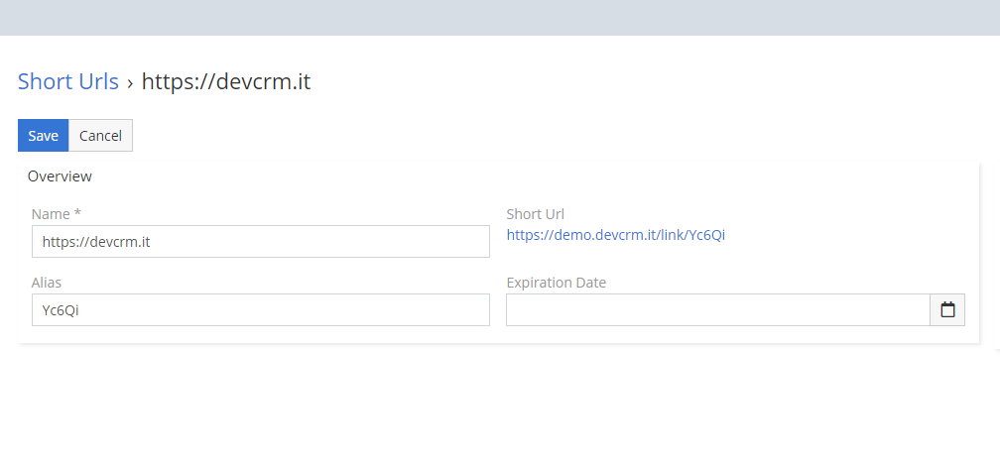

# Dubas Short Url Extension

## :material-information-outline: General Information
Short Url extension will allow you to create shortened links without any restrictions inside EspoCRM. You will not need any additional application, just EspoCRM. After installation, you just need to configure htaccess and you can create your first shortened link. In addition to creating shortened links you can check how many people have used it, you can also define your own aliases and expiration date.

!!! info
    There is a product page for this extension: [devcrm.it/short-url](https://devcrm.it/short-url)

## :material-playlist-check:  Requirements
- EspoCRM in version 6.1.0 or higher.
- Apache web server
- PHP in version 7.3 or higher.
- Publicly available EspoCRM instance – otherwise your customers will not be able to access.

## :material-book-plus-multiple: How to create Short Url?
!!! warning "Configuration"
    Please remember about adjusting your .htaccess file. [Check how to do this](#how-to-setup-htaccess-file-to-use-link-slug-in-short-urls).
1. Go to **Short Urls**.
2. Create new Short Url.
3. Enter in name field long URL.
4. Save.

That's it. Our extension will generate short URL. You can also define your own slug in alias field.

## :material-cube-scan: Demo
You can check this extension on our demo instance: [demo.devcrm.it](https://demo.devcrm.it)  
Username: **short**  
Password: **dubas**

## :material-video-box: Video Presentation
<div class="video-wrapper">
  <iframe width="1280" height="400" src="https://www.youtube.com/embed/L167G2n-y5I" frameborder="0" allowfullscreen></iframe>
</div>

## :material-folder-information-outline: Explanation of fields
1. **Alias** - This field contain generated unique, random string. String will only generate if field is empty. Based on this alias, extension generate Short Url.
2. **Clicks** - This field contain amount of redirected users through short url.
3. **Expiration Date** - In this field you can define when short url should expire. After expiration date users will see error. You can leave this field empty.
4. **Name** - This field contain full url to which user will be redirected after he use short url.
5. **Short Url** - Field contain automatically generated short url based on alias.

## How to setup .htaccess file to use link slug in Short Urls
1. Log in to your FTP/SSH server.
2. Go to main directory of your EspoCRM.
3. Open .htaccess file.
4. Before `</IfModule>` add: `RewriteRule ^link/(.*)$ {CRM_URL}/api/v1/l/$1 [L]`. Of course you have to replace **{CRM_URL}** with your domain.  
Example: `RewriteRule ^link/(.*)$ https://demo.devcrm.it/api/v1/l/$1 [L]`

## How to change length of aliases?
1. Log in to SSH/FTP server.
2. Go to main directory of your EspoCRM.
3. Go to: `custom/Espo/Custom/Resources/metadata/app`. If any of these folders not exists, create it.
4. Create in this directory file called `dubasShortUrlOptions.json`.
5. In this file paste this:   
```
{
    "length": 10   
}
```
6. Log in to EspoCRM as admin and go to  **Administration -> Clear Cache** to clear cache.

That's it. Now all new url's will have ten characters. Of course you can change it to whatever you want. Just remember, that alias can't be too short, because after some time our extension will not be able to generate unique aliases.

## How to increase limit characters in Full Url field?
Current limit of characters in Full Url field is 300 characters. If you want to increase on your instance, you just have to add new value to Custom directory. To do so follow these steps:

1. Log in to your FTP/SSH server.
2. Go to main directory of your EspoCRM instance.
3. Go to `custom/Espo/Custom/Resources/metadata/entityDefs/`.
4. Create file `ShortUrl.json`.
5. Paste this in `ShortUrl.json`
```
{
    "fields": {
        "name": {
            "maxLength": 500
        }
    }   
}
```