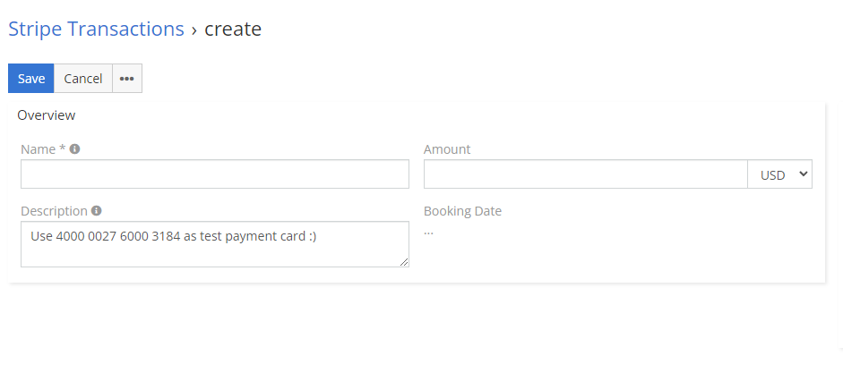

# Stripe Transactions

## :material-book-plus-multiple: How to create your first Stripe Transaction?
1.	Go to **Stripe Transactions** entity in your EspoCRM.
2.	Create new **Stripe Transaction**.
3.	Fill field name and amount. Field status switch to `Active`.
4.	Optionally fill description of transaction or link transaction to different record through parent field.
5.	Save.

That’s it. After that you should see Payment URL which you can share with your customer. After your customer pay, status of transaction change to **Paid**. 

<!-- ## :material-video-box: Video Presentation

  <iframe width="1280" height="400" src="https://www.youtube.com/embed/2RuvyfzJs-I" frameborder="0" allowfullscreen></iframe>

 -->