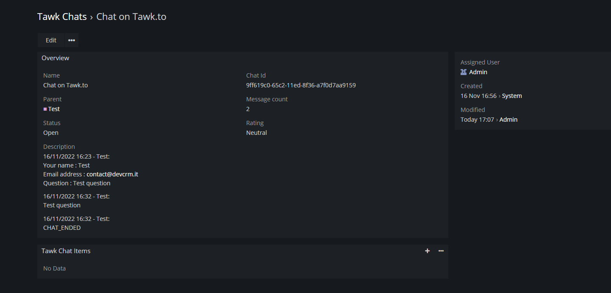

# Dubas Tawk.to Integration for EspoCRM

Tawk.to is a platform which allow to communicate with customers online through chat. We've prepared integration which allow to fetch chat history from Tawk.to to EspoCRM. This allows us to develop various automations in Advanced Pack or use it in Reports.

!!! tip "Purchase online"
    You can purchase this extension in our [online store](https://store.devcrm.it/product/tawk/).

## :material-playlist-check:  Requirements
- EspoCRM in version 7.0.0 or higher.
- PHP in version 7.4 or higher.
- Tawk.to account with access to API

!!! note "Product page"
    You can find more information on [our website](https://devcrm.it/tawk).

## :material-view-grid-plus: Installation
1.	Log in to your EspoCRM and go to Administration section.
2.	Go to section Extensions.
3. Install extension which you received from us.

## :material-tune: Initial configuration
1.	Get [API access to Tawk.to](https://help.tawk.to/article/rest-api).
2.	Go to **Administration > Integrations**.
3.  Choose Tawk integration.
3.	Enable Tawk integration.
4.	Paste Tawk.to API key.
5.	Save settings.

Now you can start using Tawk.to in your EspoCRM. 
If you want to test Integration, simply start conversation through Tawk.to chat on your website.
