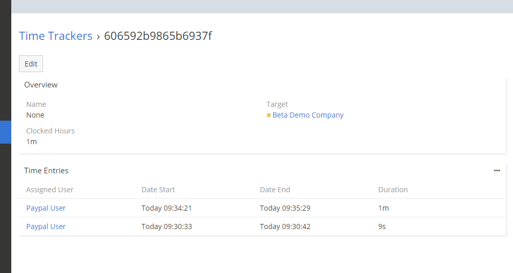

# Dubas Time Tracker

Time Tracker is a paid extension for EspoCRM that will add time tracking features to your application in modules such as Cases, Tasks or Opportunities. The extension allow you to start and stop time counting without using any external application. All magic happens in EspoCRM. The extension allows you not only to count time, but also to view all time logs, check how much time was counted for a specific task, etc.

!!! tip "Purchase online"
    You can purchase this extension in our [marketplace](https://devcrm.it/time-tracker).

## :material-cube-scan: Demo instance
You can test Time Tracker extension on our demo. Login to [demo.devcrm.it](https://demo.devcrm.it) using credentials:  
Username: **time**  
Password: **dubas**

## :material-video-box: Video Presentation

  <iframe width="1280" height="400" src="https://www.youtube.com/embed/urG_ZcYL1Fk" frameborder="0" allowfullscreen></iframe>

## Our plans
You can check our current plans for this extension on [our website](https://devcrm.it/time-tracker#issues).
