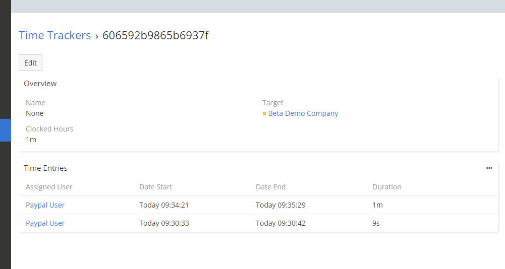

# Dubas Time Tracker

Time Tracker to płatne rozszerzenie dla EspoCRM, które dodaje funkcje ewidencjonowania czasu do Twojej aplikacji w takich modułach jak Sprawy, Zadania czy Szanse. Rozszerzenie umożliwia rozpoczęcie i zatrzymanie pomiaru czasu bez korzystania z zewnętrznych aplikacji. Cała magia dzieje się w EspoCRM. Rozszerzenie pozwala nie tylko rejestrować czas, ale także przeglądać wszystkie zapisy czasu, sprawdzać, ile czasu zostało zarejestrowane dla konkretnego zadania itp.

!!! tip "Order Now"
  Możesz kupić to rozszerzenie w naszym [marketplace](https://devcrm.it/product/time-tracker/).

## :material-cube-scan: Demo instance
Możesz przetestować rozszerzenie Time Tracker na naszej wersji demonstracyjnej. Zaloguj się na [demo.devcrm.it](https://demo.devcrm.it), używając danych logowania:
Username: **admin**
Password: **dubas**

## :material-video-box: Video Presentation

  <iframe width="1280" height="400" src="https://www.youtube.com/embed/urG_ZcYL1Fk" frameborder="0" allowfullscreen></iframe>

## Time Tracker in custom entities
Jeśli chcesz włączyć Time Tracker dla niestandardowej encji, przejdź do **Administration > Entity Manager > Time Entry > Fields > Parent** i dodaj swoją niestandardową encję do listy dozwolonych encji. Następnie wykonaj to samo dla encji **Time Sheets** — przejdź do **Administration > Entity Manager > Time Sheet > Fields > Parent** i dodaj niestandardową encję do listy dozwolonych encji.

Następnie odśwież stronę z encją i korzystaj z Time Tracker.

## Our plans
Aktualne plany dla tego rozszerzenia znajdziesz na [naszej stronie internetowej](https://devcrm.it/time-tracker#issues).
