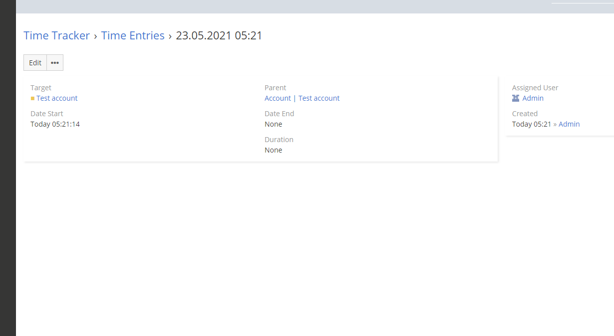

# Time Entries

Entität, die eine Unterentität von Time Trackers ist. Ein Time-Entry wird immer erstellt, wenn du mit der Zeiterfassung beginnst. Der Time-Entry wird dem Benutzer zugewiesen, der den Countdown gestartet hat.