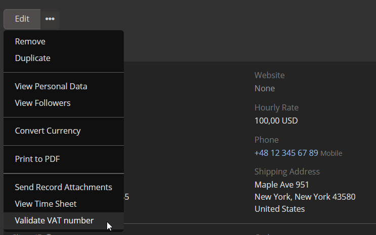

# Dubas VAT/VIES Integration for EspoCRM

The VAT/VIES Integration for EspoCRM enables users to validate their customers' VAT numbers using the VIES (VAT Information Exchange System) database. This helps ensure that the VAT numbers provided by customers are accurate and valid, supporting compliance and preventing errors.

!!! tip "Order Now"
    You can purchase this extension in our [marketplace](https://devcrm.it/product/vies).

## :material-playlist-check: Requirements
- EspoCRM version 8.1.0 or higher.
- PHP version 8.1 or higher.
- Active internet connection to access the VIES database.

## :material-view-grid-plus: Installation
1. Log in to your EspoCRM and go to the **Administration** section.
2. Navigate to the **Extensions** tab.
3. Install the extension provided by Dubas.

## :material-tune: Initial Configuration
1. Go to **Administration**.
2. Search for **Vies Settings**.
3. Enable the integration.
4. Configure the validation settings according to your preferences.
5. Save settings.

Now, you can use the integration to validate VAT numbers provided by your customers.

### Custom VAT number field
By default our extension create `vatNumber` field in Account entity, but you can use any other field if you'd like. To change field:

1. Log in to SSH/FTP.
2. Change directory to EspoCRM.
3. Open `data` directory.
4. Modify `config.php` file.
5. Add param `vatNumberField` to config file and specify which field we should use.
6. Save and clear cache in Administration section.

## :material-file-document-outline: How It Works
1. Enter the VAT number of a customer in the appropriate field while creating or editing a record and save.
2. Click on three dots next to Edit button and choose option **Validate VAT number** button to check the VAT number in the VIES database.
3. If the VAT number is valid, the system will confirm its validity.
4. If invalid, an error message will appear, prompting you to verify the provided VAT number.

## :material-script-text-outline: Formula
There is a formula `util\viesValidation` which allows to validate account in real time. The proper usage of formula is `util\viesValidation(ACCOUNT_ID)`. You can use it for example to validate an account while invoice creation.

## :material-alert-circle-outline: Limitations
- The integration only **validates** VAT numbers and does not retrieve additional company information.
- It does not update or overwrite existing records in EspoCRM.

## :material-format-list-text: What information we store
Each validation request to VIES leaves a trace in EspoCRM to make sure that in the future you'll be able to check history of validations.

Each Account have fields:

1. `VAT Verification Date` - field store date of last verification
2. `VAT Status` - field store boolean with last validation status
3. `VAT Number` - field store VAT number
4. `VAT Verifications` - relation/list of all verifications

We've created also additional entity which store historical data.
