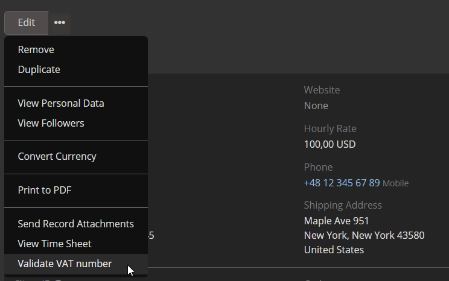

# Integracja VAT/VIES firmy Dubas dla EspoCRM

Integracja VAT/VIES dla EspoCRM umożliwia użytkownikom weryfikację numerów VAT klientów przy użyciu bazy VIES (VAT Information Exchange System). Pomaga to zapewnić, że podane numery VAT są poprawne i ważne, wspierając zgodność i zapobiegając błędom.

!!! tip "Order Now"
    To rozszerzenie można kupić w naszym [marketplace](https://devcrm.it/product/vies).

## :material-playlist-check: Requirements
- Wersja EspoCRM 8.1.0 lub wyższa.
- Wersja PHP 8.1 lub wyższa.
- Aktywne połączenie internetowe do dostępu do bazy VIES.

## :material-view-grid-plus: Installation
1. Zaloguj się do EspoCRM i przejdź do sekcji **Administracja**.
2. Otwórz kartę **Rozszerzenia**.
3. Zainstaluj rozszerzenie dostarczone przez Dubas.

## :material-tune: Initial Configuration
1. Przejdź do **Administracja**.
2. Wyszukaj **Ustawienia Vies**.
3. Włącz integrację.
4. Skonfiguruj ustawienia weryfikacji zgodnie z własnymi preferencjami.
5. Zapisz ustawienia.

Teraz możesz używać integracji do weryfikacji numerów VAT podanych przez klientów.

### Custom VAT number field
Domyślnie nasze rozszerzenie tworzy pole `vatNumber` w encji Account, ale możesz użyć dowolnego innego pola. Aby zmienić pole:

1. Zaloguj się przez SSH/FTP.
2. Przejdź do katalogu EspoCRM.
3. Otwórz katalog `data`.
4. Zmodyfikuj plik `config.php`.
5. Dodaj parametr `vatNumberField` do pliku konfiguracyjnego i wskaż, którego pola mamy używać.
6. Zapisz zmiany i wyczyść pamięć podręczną w sekcji Administracja.

## :material-file-document-outline: How It Works
1. Wprowadź numer VAT klienta w odpowiednim polu podczas tworzenia lub edycji rekordu i zapisz.
2. Kliknij trzy kropki obok przycisku Edytuj i wybierz opcję **Validate VAT number**, aby sprawdzić numer VAT w bazie VIES.
3. Jeśli numer VAT jest poprawny, system potwierdzi jego ważność.
4. Jeśli jest nieprawidłowy, pojawi się komunikat o błędzie z prośbą o zweryfikowanie podanego numeru VAT.

## :material-script-text-outline: Formula
Istnieje formuła `util\viesValidation`, która pozwala weryfikować konto w czasie rzeczywistym. Poprawne użycie formuły to `util\viesValidation(ACCOUNT_ID)`. Możesz jej użyć na przykład do weryfikacji konta podczas tworzenia faktury.

## :material-alert-circle-outline: Limitations
- Integracja tylko **weryfikuje** numery VAT i nie pobiera dodatkowych informacji o firmie.
- Nie aktualizuje ani nie nadpisuje istniejących rekordów w EspoCRM.

## :material-format-list-text: What information we store
Każde zapytanie weryfikacyjne do VIES pozostawia ślad w EspoCRM, aby w przyszłości można było sprawdzić historię weryfikacji.

Każde konto ma pola:

1. `VAT Verification Date` - pole przechowuje datę ostatniej weryfikacji
2. `VAT Status` - pole przechowuje wartość logiczną z ostatnim statusem weryfikacji
3. `VAT Number` - pole przechowuje numer VAT
4. `VAT Verifications` - relacja/lista wszystkich weryfikacji

Utworzyliśmy także dodatkową encję, która przechowuje dane historyczne.
