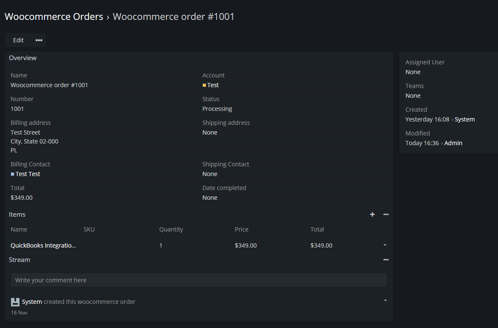

# Dubas Paypal Integration for EspoCRM

Paypal Integration was originally developed for internal use within our company. After many months of developing this extension and running internal tests, we decided to release the Paypal integration as an extension. 

!!! note ""
    You can find more information on [our website](https://devcrm.it/woocommerce).

## :material-playlist-check:  Requirements
- EspoCRM in version 7.0.0 or higher.
- PHP in version 7.4 or higher.
- Publicly available EspoCRM instance – it’s required because WooCommerce use webhooks to transfer some information.
- SalesPack extension

## :material-view-grid-plus: Installation
1.	Log in to your EspoCRM and go to Administration section.
2.	Go to section Extensions.
3. Install extension which you received from us.

4. Log in to your WordPress.
5. Go to WooCommerce -> Settings -> Advanced -> REST Api.
6. Create API credentials for your EspoCRM, copy them.
7. Log in to your EspoCRM admin account and go to Admin -> Integrations.
8. Paste there API keys from your WooCommerce.
9. Go to EspoCRM -> Administration section -> WooCommerce Webhooks.
10. Create new two webhooks for creating and updating orders.

## :material-tune: Initial configuration
1.	Go to **Administration > Integrations**.
2.	Choose WooCommerce integration.
3.	Enable WooCommerce integration.
4.	Go to WooCommerce -> Settings -> Advanced -> REST Api.
5.	Create API credentials for your EspoCRM, copy them.
6.	Log in to your EspoCRM admin account and go to Admin -> Integrations.
7.	Paste in EspoCRM API keys from your WooCommerce.
8.	Save settings.
9.	Go to **Administration > WooCommerce Webhooks**.
10.	Create new two webhooks for creating and updating orders.

Now you can start using WooCommerce in your EspoCRM. You can add WooCommerce Orders entity to your menu.
If you want to test Integration, create new Order on your WooCommerce website.
