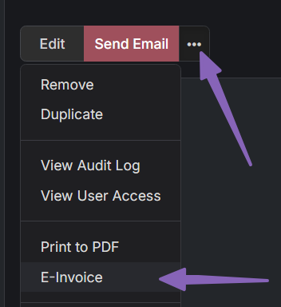
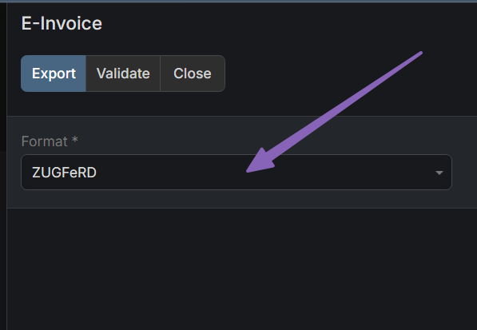
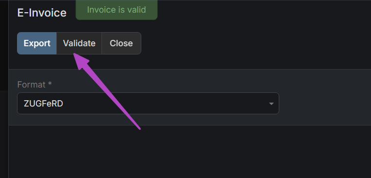
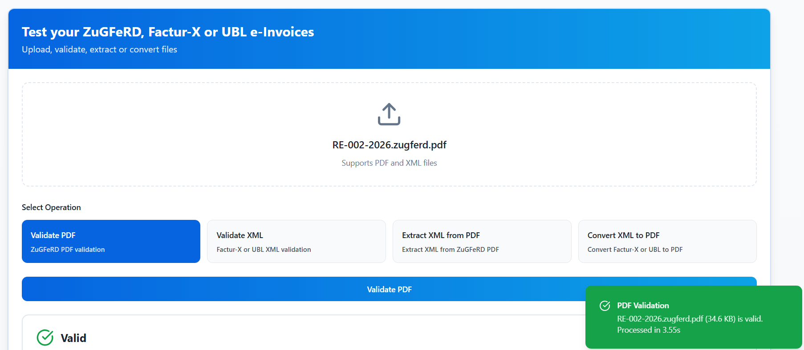

# How to generate a ZuGFeRD e-invoice from the Sales Pack in EspoCRM?

1. Go to Invoices or Credit Notes.
2. Create a new record or use an existing one.
3. Open the dropdown menu:

Choose the appropriate format in the popup.

You can validate the structure by clicking the **Validate** button.

To export the PDF, click the **Export** button.

That's all. As you can see below, the generated PDF is successfully validated by an external validator as well.

